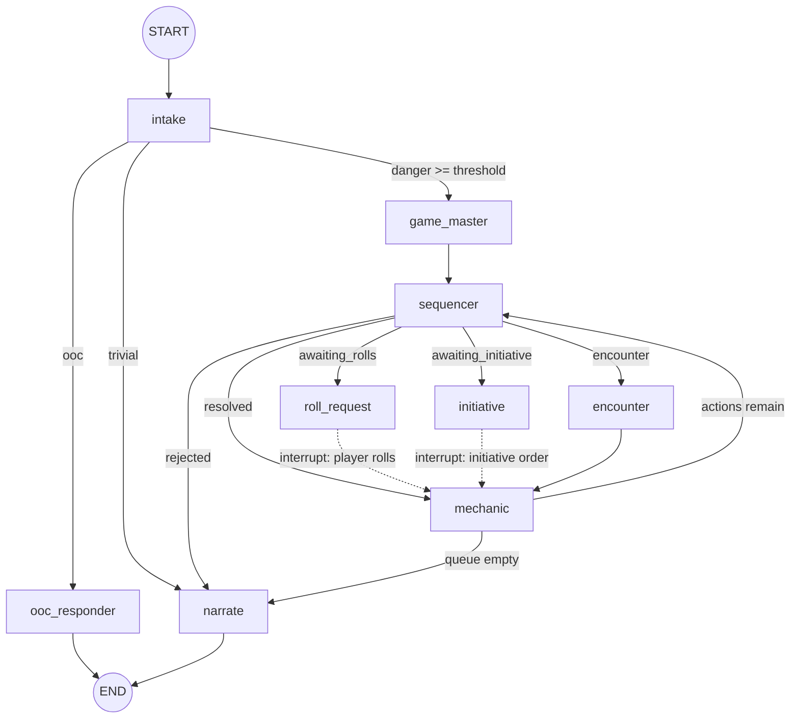

# What LangChain / LangGraph Already Solve (vs. the Rails repo)

A side-by-side of problems the old Ruby app (`../app`) solved by hand, and the
LangChain / LangGraph features that solve the same problem out of the box.

Each section shows the **hand-rolled Ruby**, the **idiomatic Lang-stack
equivalent**, and a one-line takeaway. Ruby paths are relative to the Rails repo
(`app/services/...`).

Rule of thumb:

- **LangChain** = one model interaction done well (model wrapper, prompts,
output parsing, tools, embeddings, retries, token accounting).
- **LangGraph** = orchestration of many steps (stateful graph: nodes, edges,
loops, branches, parallelism, and durable pause/resume).

---

## 1. Calling the LLM with retries / backoff

**Ruby — `app/services/ai/client.rb`** hand-rolls the OpenAI call plus a full
retry/backoff state machine:

```ruby
def chat(system_prompt:, user_message: nil, model: nil, reasoning_effort: nil, ...)
  params = { model: effective_model, messages: chat_messages,
             response_format: { type: "json_object" } }
  params[:reasoning_effort] = reasoning_effort if reasoning_effort.present? && is_reasoning

  response = with_openai_retries(call_type: "chat", model: effective_model) do
    @client.chat(parameters: params)
  end
  # ...manual error mapping for BadRequest / TooManyRequests / ServerError...
end

def with_openai_retries(call_type:, model:)
  attempt = 0
  begin
    attempt += 1
    yield
  rescue Faraday::TooManyRequestsError, Faraday::ServerError, ... => e
    raise unless retry_openai_error?(attempt, e)
    sleep(jittered_backoff_delay(attempt))   # honors Retry-After, exponential + jitter
    retry
  end
end
```

**LangChain** — the model is a `Runnable`; retries/backoff are one combinator:

```python
from langchain.chat_models import init_chat_model

llm = init_chat_model("gpt-5-nano", model_provider="openai").with_retry(
    retry_if_exception_type=(RateLimitError, APIConnectionError),
    wait_exponential_jitter=True,
    stop_after_attempt=3,
)
resp = llm.invoke(messages)          # retries/backoff handled internally
```

Takeaway: `Ai::Client#chat` + `with_openai_retries` + `jittered_backoff_delay`
≈ a `ChatModel` Runnable + `.with_retry(wait_exponential_jitter=True)`.

---

## 2. Forcing & parsing structured (JSON) output

**Ruby — `app/services/ai/client.rb`** uses `response_format: json_object`, then
strips code fences and `JSON.parse`s by hand, with a fallback:

```ruby
def parse_json(raw, fallback_as: nil)
  cleaned = raw.strip.gsub(/\A```(?:json)?\s*/, "").gsub(/\s*```\z/, "").strip
  JSON.parse(cleaned)
rescue JSON::ParserError
  if fallback_as == :dm_response && cleaned.present?
    { "narrative" => cleaned }           # treat as narrative on parse failure
  else
    raise Error, "Failed to parse AI response as JSON"
  end
end
```

Validation/coercion lived separately in `templates/schemas/*.json`,
`app/services/coerce.rb`, and `app/services/transformers/`.

**LangChain** — declare a schema; the model returns a typed object (validated,
no fence-stripping, no manual `JSON.parse`). The schema is not just types — the
class docstring and per-field descriptions are the *instructions* the model
reads, so this is where the prompt engineering that Ruby put in `.erb` templates
now lives:

```python
from typing import Literal
from pydantic import BaseModel, Field

class Intake(BaseModel):
    """Classify the player's input so the turn can be routed."""   # sent to the model

    danger_score: int = Field(
        ge=0, le=10,
        description="How dangerous the attempted action is, 0 (safe) to 10 (lethal).",
    )
    sanitized_input: str = Field(
        description="The player's input with OOC/meta chatter stripped, in-fiction only.",
    )
    intent_type: Literal["combat", "social", "exploration", "ooc"] = Field(
        description="The kind of action the player is attempting.",
    )

structured = llm.with_structured_output(Intake)
result: Intake = structured.invoke(messages)   # already parsed + validated
```

### How does the model know to fill it?

Because the schema is *sent to the model* as part of the request — it isn't
inferred from the variable name. `with_structured_output` serialises your class
to JSON Schema (field names, types, `Literal`s → `enum`, the docstring and each
`description`) and wires it up via one of three provider mechanisms:

- **Tool/function calling** (common default): the schema is registered as a
forced "tool" (`tool_choice`), so the model replies with a tool call whose
arguments are JSON matching the schema. Models are fine-tuned to fill function
arguments, so this is reliable.
- **Structured Outputs / `json_schema`** (e.g. OpenAI): the schema is passed as
`response_format` and decoding is *grammar-constrained* — the model physically
cannot emit a token that breaks the schema. Schema-valid output is guaranteed.
- `**json_mode**`: weakest — forces valid JSON but not your shape; you lean on
the prompt to describe fields.

What the model actually receives for `Intake` is roughly:

```json
{
  "name": "Intake",
  "description": "Classify the player's input so the turn can be routed.",
  "parameters": {
    "type": "object",
    "properties": {
      "danger_score": {"type": "integer", "minimum": 0, "maximum": 10,
                        "description": "How dangerous the attempted action is, 0 (safe) to 10 (lethal)."},
      "sanitized_input": {"type": "string",
                          "description": "The player's input with OOC/meta chatter stripped, in-fiction only."},
      "intent_type": {"enum": ["combat", "social", "exploration", "ooc"],
                      "description": "The kind of action the player is attempting."}
    },
    "required": ["danger_score", "sanitized_input", "intent_type"]
  }
}
```

So the "forcing" isn't free magic: the *types* are enforced by the provider
(constrained decoding or the tool-call contract), but the *meaning* — what
`danger_score: 7` should mean, what counts as `ooc` — still has to be taught
through the docstring and `description`s. That's the work that moved out of the
Ruby `.erb` prompt and into the schema; skip it and you get well-typed garbage.

Takeaway: `parse_json` + `schemas/*.json` + `coerce.rb` ≈
`llm.with_structured_output(PydanticModel)`, with the field `description`s
absorbing the prompt guidance the Ruby templates used to carry (use
`OutputFixingParser` for the "retry/fallback on bad output" behavior).

---

## 3. Prompt templating (system + user split)

**Ruby — `app/services/ai/prompt_renderer.rb`** renders ERB and splits one
template into system/user halves on a magic separator:

```ruby
USER_MESSAGE_SEPARATOR = "---USER_MESSAGE---"

def self.render_with_user_message(template_name, **locals)
  full = render(template_name, **locals)          # ERB.new(...).result(binding)
  parts = full.split(USER_MESSAGE_SEPARATOR, 2)
  [parts[0].strip, parts[1].strip]                # => [system, user]
end
```

…with `templates/*.erb` (`intake.text.erb`, `game_master.text.erb`, …) and
`templates/partials/_*.erb` for shared fragments.

**LangChain** — a `ChatPromptTemplate` *is* the system/user structure, with
variable substitution built in:

```python
from langchain_core.prompts import ChatPromptTemplate

intake_prompt = ChatPromptTemplate.from_messages([
    ("system", "You are the intake step.\nRecent conversation:\n{recent_conversation}"),
    ("human", "{player_input}"),
])
messages = intake_prompt.invoke({"recent_conversation": convo, "player_input": text})
```

### Partials (shared fragments)

Ruby reused prose via `templates/partials/_*.erb` — e.g. a `_house_rules.erb`
rendered into both the intake and narrate templates. LangChain has the same idea:
factor the fragment out and compose it into each step prompt. The cleanest form
is a plain Python string/template plus `.partial(...)`, which pre-binds the
fragment so call sites never repeat it (the analogue of a partial being rendered
inside each template):

```python
from langchain_core.prompts import ChatPromptTemplate

# The "partial": a reusable fragment ≈ templates/partials/_house_rules.erb
HOUSE_RULES = (
    "House rules:\n"
    "- Stay in third-person narration.\n"
    "- Never decide the player's actions for them.\n"
    "- Keep replies under 120 words.\n"
)

# Composed into multiple step prompts, then pre-bound with .partial so callers
# only pass the step-specific variables.
intake_prompt = ChatPromptTemplate.from_messages([
    ("system", "You are the intake step.\n{house_rules}\nRecent conversation:\n{recent_conversation}"),
    ("human", "{player_input}"),
]).partial(house_rules=HOUSE_RULES)

narrate_prompt = ChatPromptTemplate.from_messages([
    ("system", "You are the narrator.\n{house_rules}\nScene:\n{scene}"),
    ("human", "{player_input}"),
]).partial(house_rules=HOUSE_RULES)

# house_rules is already filled in — only the per-call vars remain:
messages = intake_prompt.invoke({"recent_conversation": convo, "player_input": text})
```

If a fragment needs its *own* variables (a partial that takes locals), render it
first and pass the result in — LangChain deprecated `PipelinePromptTemplate` in
favor of composing prompts in plain Python:

```python
sheet_partial = ChatPromptTemplate.from_template("Character sheet:\n{sheet_summary}")
rendered = sheet_partial.invoke({"sheet_summary": summary}).to_string()
messages = narrate_prompt.invoke({"house_rules_extra": rendered, "scene": scene, "player_input": text})
```

Takeaway: `PromptRenderer` + `.erb` + `USER_MESSAGE_SEPARATOR` ≈
`ChatPromptTemplate.from_messages([...])`; `templates/partials/_*.erb` ≈ a
reusable fragment composed into each prompt and pre-bound with `.partial(...)`
(render-then-inject in Python for fragments that take their own variables).

---

## 4. Per-step model + reasoning routing

**Ruby — `app/services/ai/step_registry.rb`** keeps a registry of which model /
reasoning effort each pipeline step uses; `Ai::Client#chat` takes a per-call
`model:` / `reasoning_effort:` override:

```ruby
STEPS = {
  'intake'      => Entry.new(model_hint: H::INTAKE,      pipeline: true),
  'game_master' => Entry.new(model_hint: H::GAME_MASTER, pipeline: true),
  'narrate'     => Entry.new(model_hint: H::NARRATE,     pipeline: true),
  # ...
}.freeze

# usage (steps/intake.rb):
@ai.chat(system_prompt:, user_message:, step_name: "intake",
         model: @config.model_for("intake"),
         reasoning_effort: @config.reasoning_effort_for("intake"))
```

**LangChain** — the registry is just variables: build one model per step, then
each step calls its own. There's no shared dispatcher — the models are used
together simply by invoking the right one at each stage and passing results
along:

```python
from langchain.chat_models import init_chat_model

# What StepRegistry encoded — a cheap model for triage, a strong one for prose.
intake_llm  = init_chat_model("gpt-5-nano", reasoning_effort="minimal")
narrate_llm = init_chat_model("gpt-5",      reasoning={"effort": "medium"})

# One turn, two models: intake classifies, and its result feeds narration.
intake = intake_llm.with_structured_output(Intake).invoke(intake_messages)
reply  = narrate_llm.invoke(narrate_prompt.invoke({"danger": intake.danger_score, "scene": scene}))
```

**LangGraph** — the same two models, now as nodes. The per-step model is just
captured inside that node's function, so "routing" becomes *which node runs*, not
a registry lookup:

```python
from langgraph.graph import StateGraph, START, END

def intake(state: TurnState) -> dict:                  # cheap model
    out = intake_llm.with_structured_output(Intake).invoke(state["intake_messages"])
    return {"danger": out.danger_score}

def narrate(state: TurnState) -> dict:                 # strong model
    reply = narrate_llm.invoke(narrate_prompt.invoke({"danger": state["danger"], "scene": state["scene"]}))
    return {"reply": reply.content}

builder = StateGraph(TurnState)
builder.add_node("intake", intake)
builder.add_node("narrate", narrate)
builder.add_edge(START, "intake")
builder.add_edge("intake", "narrate")
builder.add_edge("narrate", END)
graph = builder.compile()

graph.invoke({"intake_messages": ..., "scene": ...})   # runs intake -> narrate, each on its own model
```

(`TurnState` and the graph mechanics are covered in §7; the point here is only
that each node closes over its own `init_chat_model`.)

Takeaway: `StepRegistry` + `model_hints` + per-call `model:`/`reasoning_effort:`
≈ one `init_chat_model(...)` per step — invoked directly (LangChain) or captured
in a node (LangGraph), with no registry or dispatcher needed.

---

## 5. Tool calling (request a dice roll)

**Ruby — `app/services/tools/registry.rb`** defines a tool table, validates the
model's tool calls, caps them, and dispatches by hand:

```ruby
SUPPORTED = {
  "request_roll" => {
    required_args: %w[intent_text],
    dispatch: ->(engine, args) { engine.run_roll_request_as_ai_called_tool(args.fetch("intent_text")) }
  }
}.freeze

def self.dispatch(tool_calls, pipeline_engine:)
  validate_calls!(tool_calls)                     # arity, names, required args, MAX_CALLS_PER_TURN
  tool_calls.each { |c| SUPPORTED.fetch(c["name"])[:dispatch].call(pipeline_engine, c["args"]) }
end
```

**LangChain / LangGraph** — declare a `@tool`, `bind_tools`, and let the prebuilt
`ToolNode` validate args (from the schema) and dispatch:

```python
from langchain_core.tools import tool
from langgraph.prebuilt import ToolNode

@tool
def request_roll(intent_text: str) -> str:
    """Ask the player to roll for the given intent."""
    return run_roll_request(intent_text)

llm_with_tools = llm.bind_tools([request_roll])   # schema -> model
tool_node = ToolNode([request_roll])              # validates + executes tool calls
```

Takeaway: `Tools::Registry` (`validate_calls!`, `required_args`,
`MAX_CALLS_PER_TURN`, `dispatch`) ≈ `@tool` schemas + `bind_tools` + `ToolNode`.

---

## 6. Token-usage accounting

**Ruby — `app/services/ai/client.rb`** digs usage out of the raw response by hand:

```ruby
usage_hash = response["usage"]
@last_usage = {
  input_tokens:     usage_hash["prompt_tokens"],
  output_tokens:    usage_hash["completion_tokens"],
  reasoning_tokens: usage_hash.dig("completion_tokens_details", "reasoning_tokens") || 0,
  total_tokens:     usage_hash["total_tokens"],
}
```

**LangChain** — every response carries a normalized `usage_metadata`:

```python
resp = llm.invoke(messages)
resp.usage_metadata
# {'input_tokens': 900, 'output_tokens': 240, 'total_tokens': 1140,
#  'output_token_details': {'reasoning': 160}}
```

But the accounting only "earns its keep" when you total a whole turn. A context
manager aggregates usage across *every* model call in the block — even across
different models — so there's no `@last_usage` to thread from step to step:

```python
from langchain_core.callbacks import get_usage_metadata_callback

with get_usage_metadata_callback() as cb:
    intake = intake_llm.with_structured_output(Intake).invoke(intake_messages)  # cheap model
    reply  = narrate_llm.invoke(narrate_messages)                               # strong model

cb.usage_metadata          # totalled per model, automatically:
# {
#   "gpt-5-nano": {"input_tokens": 320, "output_tokens": 18,  "total_tokens": 338},
#   "gpt-5":      {"input_tokens": 900, "output_tokens": 240, "total_tokens": 1140,
#                  "output_token_details": {"reasoning": 160}},
# }
```

That's where you actually discern value — turning the totals into "was this turn
worth it?" is a plain price-table lookup (and LangSmith does even this for you,
§12):

```python
PRICE = {  # $ per 1M tokens: (input, output)
    "gpt-5-nano": (0.05, 0.40),
    "gpt-5":      (1.25, 10.00),
}
turn_cost = sum(
    u["input_tokens"]   / 1_000_000 * PRICE[m][0]
    + u["output_tokens"] / 1_000_000 * PRICE[m][1]
    for m, u in cb.usage_metadata.items()
)   # e.g. the cheap triage step is ~$0.00003; the narration dominates the bill
```

Takeaway: `@last_usage` per-call bookkeeping ≈ `AIMessage.usage_metadata`
(normalized per response) + `get_usage_metadata_callback()` to total a whole turn
across models — with full spend/latency dashboards free via LangSmith (§12).

---

## 7. The pipeline = a graph of steps

**Ruby — `app/services/player_turn/engine.rb`** assembles the pipeline by mixing
in one module per step:

```ruby
class Engine
  include Steps::Intake
  include Steps::GameMaster
  include Steps::Sequencer
  include Steps::RollRequest
  include Steps::Mechanic
  include Steps::Narrate
  # ...~15 steps
end
```

…and each step is a method that takes state and returns updates
(`app/services/player_turn/steps/intake.rb`):

```ruby
def run_intake(player_input)
  system_prompt = Ai::PromptRenderer.render("intake", recent_conversation: ...)
  raw    = @ai.chat(system_prompt:, user_message: player_input, step_name: "intake")
  parsed = @ai.parse_json(raw)
  { danger_score: parsed["danger_score"].to_i, sanitized_input: parsed["sanitized_input"],
    intent_type: normalize_intent_type(parsed["intent_type"]) }
end
```

**LangGraph** — nodes are functions of state; the graph wires them. Here is the
*whole* step list from the Ruby `Engine` (`Intake`, `GameMaster`, `Sequencer`,
`RollRequest`, `Mechanic`, `Narrate`) expressed as nodes + edges — one `add_node`
per `include`, the wiring order standing in for the mixin order:

```python
from langgraph.graph import StateGraph, START, END
from typing_extensions import TypedDict

class TurnState(TypedDict):
    player_input: str
    danger_score: int
    sanitized_input: str
    intent_type: str
    reply: str

# Each ≈ one Steps::* module; only intake is shown in full, the rest are the same
# shape (read state, call a model/tool, return a partial update).
def intake(state: TurnState) -> dict:
    out = intake_llm.with_structured_output(Intake).invoke(...)
    return {"danger_score": out.danger_score, "sanitized_input": out.sanitized_input,
            "intent_type": out.intent_type}

def game_master(state: TurnState) -> dict: ...   # decide what happens (may call tools)
def sequencer(state: TurnState) -> dict:   ...   # order the actions to resolve
def roll_request(state: TurnState) -> dict: ...  # ask the player to roll (interrupt — §10)
def mechanic(state: TurnState) -> dict:    ...   # apply dice results to game state
def narrate(state: TurnState) -> dict:     ...   # write the player-facing prose

builder = StateGraph(TurnState)
for name, fn in [
    ("intake", intake), ("game_master", game_master), ("sequencer", sequencer),
    ("roll_request", roll_request), ("mechanic", mechanic), ("narrate", narrate),
]:
    builder.add_node(name, fn)

# The Ruby include order ≈ these edges:
builder.add_edge(START, "intake")
builder.add_edge("intake", "game_master")
builder.add_edge("game_master", "sequencer")
builder.add_edge("sequencer", "roll_request")
builder.add_edge("roll_request", "mechanic")
builder.add_edge("mechanic", "narrate")
builder.add_edge("narrate", END)
graph = builder.compile()
```

This straight line is just the skeleton — the real turn isn't purely linear:
§8 makes `intake`/`game_master` *branch* (the danger/OOC gates → conditional
edges), and §10 turns `roll_request` into an `interrupt()` that pauses the run for
the player and resumes into `mechanic`. The point of §7 is only the structural
mapping: the pipeline *is* the graph.

Takeaway: `Engine` + `include Steps::*` (Intake/GameMaster/Sequencer/RollRequest/
Mechanic/Narrate) ≈ `StateGraph` + one `add_node` per step; each `run_<step>` ≈ a
node function; the mixin order ≈ the edges.

> **"Isn't this just a lateral move?"** For a *fixed linear* pipeline, yes — a
> `Steps::*` method that takes state and returns updates is basically a node, and
> the Ruby version is arguably simpler (no `add_node`/`add_edge` ceremony). §7 is
> the **enabler, not the payoff**. The value shows up only once the flow stops
> being a straight line, and it comes from the runtime this graph runs on
> (Pregel) — capabilities the Ruby app hand-built piece by piece:
>
> - **branching / loops** without a hand-written dispatcher (§8 vs `ActionQueueRunner`'s `case status`)
> - **pause + resume** from a checkpoint, nearly free (§10 vs the paused `AdventureLoop` + restore/resume services)
> - **parallel fan-out with reducer merges** (§11 vs `game_master_loremaster_async` + the Node.js evaluator)
> - **streaming + uniform tracing** of every transition (§6/§12 vs `timed_ai_call` / `PlayLog`)
>
> Rule of thumb: the graph pays off in proportion to how *non-linear* the flow is.
> A GM turn (rolls that pause, gates that branch, parallel lore lookups) is about
> as non-linear as it gets, so here it earns its keep; for a genuinely linear
> pipeline it would be over-engineering.

---

## 8. Conditional routing & gates

**Ruby — `app/services/player_turn/engine/action_queue_runner.rb`** branches on a
returned status string, and the danger/OOC gates short-circuit by hand:

```ruby
case result[:status]
when :rejected           then return { action: :rejected, reason: result[:reason] }
when :awaiting_rolls     then return { action: :awaiting_rolls, ... }   # pause (see 10)
when :awaiting_initiative then return { action: :awaiting_initiative, ... }
when :encounter          then accumulated << result; break
when :resolved           then resolved_history << result
end
```

**LangGraph** — a router function + `add_conditional_edges` (or `Command(goto=)`):

```python
def route_after_intake(state: TurnState) -> str:
    if state["intent_type"] == "ooc":      return "ooc_responder"
    if state["danger_score"] >= DANGER:    return "game_master"
    return "narrate"

builder.add_conditional_edges("intake", route_after_intake,
                              {"ooc_responder": "ooc_responder",
                               "game_master": "game_master",
                               "narrate": "narrate"})
```

### The whole legacy pipeline as one graph

The single gate above is the small version. Here is the *full* player-turn
pipeline — every gate, the action-queue dispatch (`ActionQueueRunner`'s
`case status`), the two pause "moments", and the resolution **loop** — wired as
one graph. This is what a real, branch-heavy turn looks like:

```python
from langgraph.graph import StateGraph, START, END
from langgraph.types import interrupt

builder = StateGraph(TurnState)
for name, fn in [
    ("intake", intake), ("ooc_responder", ooc_responder), ("game_master", game_master),
    ("sequencer", sequencer), ("roll_request", roll_request), ("initiative", initiative),
    ("encounter", encounter), ("mechanic", mechanic), ("narrate", narrate),
]:
    builder.add_node(name, fn)

builder.add_edge(START, "intake")

# Gate 1 — intake: OOC chatter and danger level pick the path.
def after_intake(state) -> str:
    if state["intent_type"] == "ooc":   return "ooc_responder"
    if state["danger_score"] >= DANGER: return "game_master"
    return "narrate"                       # trivial action: narrate directly
builder.add_conditional_edges("intake", after_intake,
                              ["ooc_responder", "game_master", "narrate"])
builder.add_edge("ooc_responder", END)

builder.add_edge("game_master", "sequencer")

# Gate 2 — the ActionQueueRunner dispatch: each queued action resolves to one of
# these (≈ Ruby `case result[:status]`).
def dispatch_action(state) -> str:
    return {
        "rejected":            "narrate",
        "awaiting_rolls":      "roll_request",   # pause moment
        "awaiting_initiative": "initiative",     # pause moment
        "encounter":           "encounter",
        "resolved":            "mechanic",
    }[state["action_status"]]
builder.add_conditional_edges("sequencer", dispatch_action,
                              ["roll_request", "initiative", "encounter", "mechanic", "narrate"])

# The two "moments": each pauses the run for the player (§10), then resumes into
# mechanic. The interrupt lives inside the node:
def roll_request(state) -> dict:
    rolls = interrupt({"needs": "player rolls", "for": state["pending_action"]})
    return {"submitted_rolls": rolls}
builder.add_edge("roll_request", "mechanic")
builder.add_edge("initiative", "mechanic")
builder.add_edge("encounter", "mechanic")

# Gate 3 — loop: drain the action queue, then narrate exactly once.
def after_mechanic(state) -> str:
    return "sequencer" if state["actions_remaining"] else "narrate"
builder.add_conditional_edges("mechanic", after_mechanic, ["sequencer", "narrate"])

builder.add_edge("narrate", END)
graph = builder.compile(checkpointer=checkpointer)   # checkpointer = the §10 pause/resume
```

Drawn out, the branches and the resolution loop look like this (dotted edges are
the `interrupt()` pause/resume moments):



Note what the runtime is doing here that the Ruby `ActionQueueRunner` hand-coded:
the `sequencer -> mechanic -> sequencer` **cycle** drains the queue (the engine
drives the loop, you just declare the back-edge), and `roll_request`/`initiative`
**suspend** the whole run to a checkpoint and resume on the player's submission —
no `awaiting_rolls`/`awaiting_initiative` status plumbing or paused-loop lookup.

Takeaway: the `case result[:status]` dispatch and `intake_danger_gate` /
`ooc_gate` ≈ `add_conditional_edges` / returning `Command(goto=...)`; the
queue-draining loop ≈ a conditional back-edge; the pause statuses ≈ `interrupt()`
nodes (§10).

---

## 9. Threading state between steps

**Ruby** passes plain objects/hashes (`PlayerTurn::Context`, plus `accumulated` /
`merged` / `resolved_history`) from step to step:

```ruby
class Context
  attr_reader :combined_seed, :player_action, :prior_outcomes, :death_type
end
# action_queue_runner.rb threads arrays by hand:
accumulated = initial_accumulated.dup
resolved_history << result
```

**LangGraph** — a typed `State` channel with **reducers** to merge node outputs:

```python
from typing import Annotated
from operator import add

class TurnState(TypedDict):
    player_action: str
    resolved_history: Annotated[list, add]   # nodes return partials; reducer appends
```

Takeaway: `Context` + manually accumulated arrays ≈ the graph `State` (TypedDict)
+ reducer annotations.

`AdventureLoop` actually wears two hats: it's both the *holder* of cross-step data
and a *durable, paused DB record*. §9 covers only the first — the state **schema**
(what's held, how partials merge). The second — making that state survive a pause
and a later request — is §10's checkpointer, which persists this exact `TurnState`
to a thread. So: `AdventureLoop`-as-accumulator ≈ §9; `AdventureLoop`-as-paused-row
≈ §10.

---

## 10. Pause for player input, then resume (the biggest win)

**Ruby** hand-builds durable pause/resume: it persists a paused `AdventureLoop`,
stashes roll metadata, and a separate code path later looks it up and continues.

Pause (`action_queue_runner.rb`):

```ruby
when :awaiting_rolls
  p.loop&.batch_update!(new_status: "paused",
    timeline_entry: p.tl("awaiting_rolls", "Paused for player rolls"))
  return { action: :awaiting_rolls, intent: result[:intent], merged: result[:merged],
           remaining_actions: remaining }
```

Restore (`engine.rb`):

```ruby
def restore_paused_loop!
  bind_current_loop!(
    AdventureLoop.for_registry_entry(@log.registry_entry_uuid).paused.order(:created_at).last)
  restore_cast_roster_from_paused_loop!
end
```

Resume entry (`entry_services/resume_pipeline_execution.rb` + `service.rb`):

```ruby
def execute_rolls(roll_results_text, player_message_id:)
  resume_execution.call(player_message_id:) do
    metadata = Adventures::MechanicalState.latest_roll_metadata(runtime.adventure)
    runtime.resume_or_start_pipeline!(metadata, roll_results_text)
    runtime.pipeline_engine.run_rolls(roll_results_text, metadata, submitted_rolls:)
  end
end
```

**LangGraph** — `interrupt()` pauses the graph; a **checkpointer** persists the
*entire* state to a thread; resuming is one call with `Command(resume=...)`. No
"paused loop" rows, no metadata stashing, no separate resume path.

```python
from langgraph.types import interrupt, Command
from langgraph.checkpoint.postgres import PostgresSaver

def roll_request(state: TurnState) -> dict:
    rolls = interrupt({"intent": state["intent"], "needs": "player rolls"})  # pause here
    return {"player_rolls": rolls}                                          # runs on resume

graph = builder.compile(checkpointer=PostgresSaver(...))      # durable state per thread
cfg = {"configurable": {"thread_id": adventure_id}}

graph.invoke(initial, cfg)                 # runs until interrupt(), then stops
# ... later, when the player submits dice ...
graph.invoke(Command(resume=submitted_rolls), cfg)   # continues from exactly where it paused
```

Takeaway: `AdventureLoop status: paused` + `restore_paused_loop!` +
`ResumePipelineExecution` + `run_rolls/run_initiative` ≈ `interrupt()` +
checkpointer + `Command(resume=...)`. This is the single biggest chunk of bespoke
machinery the Lang stack eliminates.

### Consecutive roll requests: a fixed step vs. a back-edge

The legacy **non-orchestrator** pipeline can only pause for rolls at *one fixed
position*. `run_roll_request` (the AI step that decides *what* to roll) runs once,
**before** the pause, inside `run_evaluation_phase`. The resume path
(`run_rolls` → `finish_resolution`) goes straight to the deterministic verdict and
narration — it never calls `run_roll_request` again:

```ruby
# adventure_loop_resolution.rb — finish_resolution (the resume path)
#   runs run_mechanic, NOT run_roll_request → no second reactive roll request
verdict_result = run_mechanic(intent, merged, roll_results:, npc_results: nil)
...
maybe_run_world_turn(status: :resolved, ...)        # → narrate
```

So after the pause the turn is committed to *resolve → narrate*. The only way it
re-pauses is via **pre-scripted** follow-ups baked into `finish_resolution`: the
attack→damage `roll_chain` (`maybe_pause_for_damage_roll`) and combat
`awaiting_initiative`. There is **no general "look at the results, then ask for a
different roll"** — to get that, the pipeline would have to be reshaped to loop
back into RollRequest.

In LangGraph that reshaping *is* the feature — a single conditional back-edge:

```python
def after_mechanic(state) -> str:
    # GM saw the roll outcome and wants another, unrelated roll
    return "roll_request" if state["needs_more_rolls"] else "narrate"
builder.add_conditional_edges("mechanic", after_mechanic, ["roll_request", "narrate"])
```

`roll_request` calls `interrupt()` every time it's entered, and the checkpointer
re-pauses automatically — so unlimited, *reactive* back-to-back roll requests cost
one edge, not a new pipeline. (The tool-calling GM expresses the same loop a
different way: the model node ⇄ `ToolNode` cycle lets the GM call `request_roll`,
see the result come back as a tool message, and decide to call it again or narrate
— see §5.)

---

## 11. Parallel fan-out

**Ruby** runs some steps concurrently by hand
(`app/services/player_turn/game_master_loremaster_async.rb`) and historically
offloaded parallel evaluation to a **separate Node.js microservice**.

**LangGraph** — fan out natively: a node returns multiple `Send`s, branches run
in parallel, and a reducer joins them. No threads-by-hand, no extra service.

```python
from langgraph.types import Send

def fan_out(state):                     # run game_master + loremaster in parallel
    return [Send("game_master", state), Send("loremaster", state)]

builder.add_conditional_edges("sequencer", fan_out)
# both nodes write into Annotated[...] channels; LangGraph joins the super-step
```

Takeaway: `game_master_loremaster_async` + the Node.js evaluator ≈ LangGraph
parallel branches (`Send` / multiple outgoing edges) with reducer joins.

---

## 12. Tracing / observability

**Ruby** wraps each call to time and record it (`timed_ai_call` in
`steps/intake.rb`, `play_log!` in `action_queue_runner.rb`) and persists
`PlayLog` / `PipelineRegistryEntry` rows for later inspection.

```ruby
parsed = timed_ai_call("intake", prompt_summary, request_body) do
  raw = @ai.chat(system_prompt:, user_message:, step_name: "intake")
  [raw, @ai.parse_json(raw)]
end
```

**LangSmith** — set two env vars and every model/chain/graph step is traced
(inputs, outputs, tokens, latency, errors) with no per-call wrapper:

```bash
export LANGSMITH_TRACING=true
export LANGSMITH_API_KEY=...
```

```python
from langsmith import traceable

@traceable          # optional: trace arbitrary non-LLM functions too
def post_process(x): ...
```

Takeaway: `timed_ai_call` + `PlayLog` + `PipelineRegistryEntry` ≈ LangSmith
automatic tracing (`@traceable` for custom spans).

---

## 13. Embeddings + caching + vector search

**Ruby — `app/services/ai/client.rb#embeddings`** + `embedding_cache.rb` hand-roll
the embeddings call, response-shape checks, ordering, and a cache; pgvector
queries live in the `lore` / `scene_retrieval` services.

```ruby
def embeddings(texts:, model:, dimensions: nil)
  response = with_openai_retries(call_type: "embeddings", model:) { @client.embeddings(parameters:) }
  data.sort_by { |row| row["index"].to_i }.map { |row| row["embedding"] }
end
```

**LangChain** — an `Embeddings` object + a `VectorStore` (pgvector) + a
cache-backed wrapper; retrieval is `.similarity_search`:

```python
from langchain_openai import OpenAIEmbeddings
from langchain_postgres import PGVector
from langchain.embeddings import CacheBackedEmbeddings
from langchain.storage import LocalFileStore

emb = CacheBackedEmbeddings.from_bytes_store(OpenAIEmbeddings(), LocalFileStore("./cache"))
store = PGVector(embeddings=emb, connection=PG_URL, collection_name="lore")
docs = store.similarity_search("ancient brazier rune", k=4)
```

Takeaway: `Ai::Client#embeddings` + `embedding_cache` + lore/scene pgvector SQL ≈
`OpenAIEmbeddings` + `CacheBackedEmbeddings` + a `PGVector` `VectorStore`.

---

## Cheat sheet

- `Ai::Client#chat` + `with_openai_retries` -> `ChatModel` Runnable + `.with_retry()`
- `parse_json` + `schemas/*.json` + `coerce` -> `with_structured_output(PydanticModel)`
- `PromptRenderer` + `*.erb` + `USER_MESSAGE_SEPARATOR` -> `ChatPromptTemplate.from_messages`
- `StepRegistry` + `model_hints` -> per-node `init_chat_model` / configurable fields
- `Tools::Registry` (`validate_calls!`, `dispatch`) -> `@tool` + `bind_tools` + `ToolNode`
- `@last_usage` -> `AIMessage.usage_metadata`
- `PlayerTurn::Engine` + `Steps::*` -> `StateGraph` + `add_node`
- `case result[:status]` + gates -> `add_conditional_edges` / `Command(goto=)`
- `Context` + accumulated hashes -> graph `State` (TypedDict) + reducers
- paused `AdventureLoop` + resume services -> `interrupt()` + checkpointer + `Command(resume=)`
- `game_master_loremaster_async` + Node.js evaluator -> `Send` parallel branches
- `timed_ai_call` + `PlayLog` -> LangSmith tracing
- `Ai::Client#embeddings` + `embedding_cache` -> `OpenAIEmbeddings` + `PGVector` + `CacheBackedEmbeddings`

