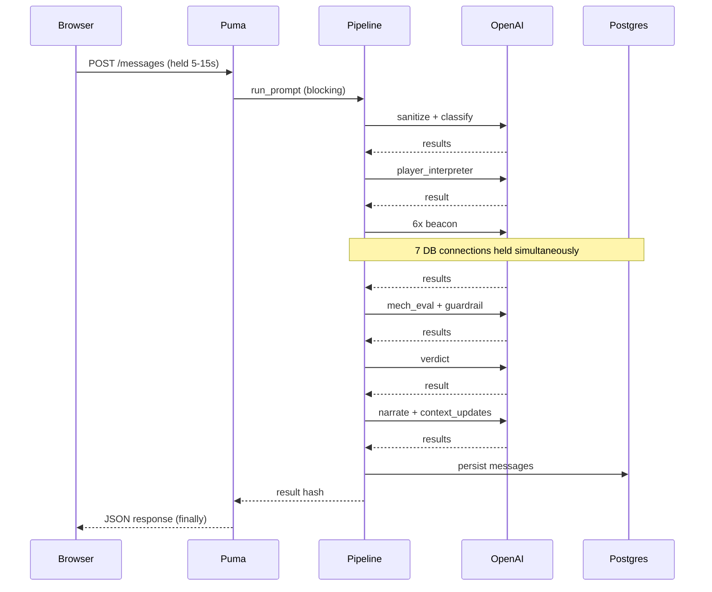
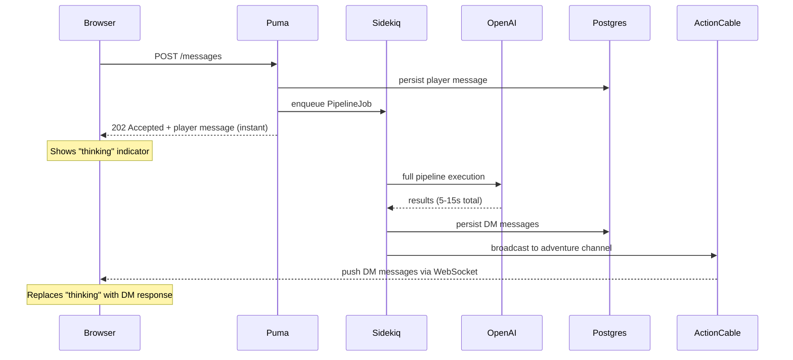

# Design Document: Async DM Pipeline via Sidekiq + ActionCable

## Problem Statement

The DM pipeline runs synchronously inside the HTTP request/response cycle. A single pipeline run takes 5-15 seconds (dominated by sequential and parallel OpenAI API calls) and holds a Puma thread hostage for the entire duration.

The pipeline spawns parallel Ruby threads for concurrent AI calls (beacon, gates, output phase). Each thread needs its own ActiveRecord database connection. With the default pool of 5 and up to 7 concurrent threads, this causes `ActiveRecord::ConnectionTimeoutError` and 500 errors.

We raised the pool to 12, which fixes the immediate crash but introduces a deeper scaling constraint:

```
1 pipeline run = 1 Puma thread blocked for 5-15s
               + up to 8 DB connections at peak (main + 6 beacon + 1 gate residual)

12-thread Puma / 8 connections per pipeline = ~1.5 concurrent pipelines max
```

Beyond ~2 simultaneous players, the server either runs out of DB connections or out of Puma threads (starving all other HTTP requests including page loads, API calls, and health checks).

### Alternatives considered

**Porting DM logic to Node.js** — Node's event loop handles I/O-bound parallelism
natively (Promises instead of threads), which would eliminate the connection pool
problem. However, this would require a full pipeline rewrite (~2000 lines), a second
service to deploy, duplicated model access, and distributed tracing. The bottleneck
is not Ruby's threading model — it's that a synchronous HTTP request holds a Puma
thread hostage while waiting on OpenAI. The correct fix is to stop blocking the HTTP
request, not to change the language.

**Increasing Puma workers (cluster mode)** — Running multiple Puma processes with
`WEB_CONCURRENCY=4` would multiply available connections (4 × 12 = 48) and support
~4-6 concurrent pipelines. However, each worker copies the full Rails app (~150-300MB
RAM), and this still ties pipeline execution to the web request cycle — every pipeline
run blocks a Puma thread for 5-15 seconds.

### Current architecture



The browser's `fetch()` blocks for the entire pipeline duration. The "thinking" spinner in the UI is purely cosmetic — no intermediate feedback is possible.

---

## Chosen Solution: Sidekiq + ActionCable

Move the pipeline execution to a Sidekiq background worker. Return an immediate acknowledgment to the browser. Push results to the frontend via ActionCable WebSocket when the pipeline completes.

### Target architecture



### Why this solves the problem

- **Puma is freed immediately.** The HTTP request returns in <50ms instead of 5-15s. Puma threads serve other requests normally.
- **DB connections are isolated.** Sidekiq workers run in a separate process with their own connection pool. The pipeline's 7-8 concurrent connections don't compete with web request connections.
- **Scales independently.** Add more Sidekiq workers to handle more concurrent pipelines without affecting web server capacity.
- **Better UX potential.** ActionCable enables future step-by-step streaming (e.g., show "Interpreting intent..." then "Rolling dice..." then final narrative).

---

## Implementation

### Feature flag

Gated by `DmConfig` toggle `async_pipeline` (default: `false`). When disabled, the
existing synchronous request/response path is used. Both paths coexist.

### Infrastructure

- `redis` and `sidekiq` gems added to Gemfile
- `config/sidekiq.yml` defines `dm_pipeline` priority queue
- `config/cable.yml` wired to Redis in development (was in-process `async` adapter)
- `REDIS_URL` added to app and worker services in `compose.yml`
- Separate `worker` service runs `bundle exec sidekiq`

### Backend

- **`AdventureChannel`** — ActionCable channel scoped per adventure with session-based user auth
- **`PipelineJob` / `RollPipelineJob`** — Sidekiq jobs that run the pipeline and broadcast results
- **`DungeonMasterService`** split into sync API (`process_player_prompt`) and async API (`prepare_prompt` + `execute_prompt`)
- **`AdventureMessagesController`** checks `async_pipeline?` and either runs sync or enqueues + returns 202

### Frontend

- `AdventureChat.tsx` subscribes to `AdventureChannel` on mount via `@rails/actioncable`
- In async mode: HTTP returns 202 with player message, thinking indicator stays until ActionCable delivers the DM response
- In sync mode: existing behavior unchanged

### Connection pool (after)

| Process | Pool Size | Peak Connections | Purpose |
|---------|-----------|-----------------|---------|
| Puma (web) | 5 | ~5 | Serve HTTP requests (fast, no pipeline) |
| Sidekiq (worker) | 12 | ~8 per pipeline | Run DM pipelines with parallel threads |

---

## Migration Path

1. Add Sidekiq, Redis wiring, ActionCable channel, PipelineJob. Keep sync as default.
2. Enable `async_pipeline` toggle to test async path.
3. Make async the default once stable. Remove sync path.
