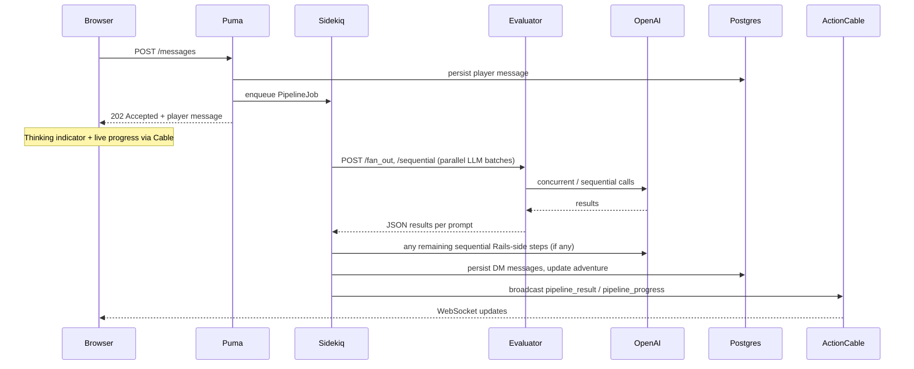

# Design Document: Async DM Pipeline via Sidekiq + ActionCable

## Historical problem (pre–Sidekiq)

Originally the DM pipeline ran **synchronously inside the HTTP request**. A single run took on the order of **5–15 seconds** (OpenAI calls) and held a **Puma** worker thread for the entire duration. The browser’s `fetch()` waited until the pipeline finished.

Parallel OpenAI work was sometimes done with **Ruby `Thread.new`**, with each thread taking an **ActiveRecord** connection from the pool. That could cause `ActiveRecord::ConnectionTimeoutError` when the web server’s pool was small and several threads needed DB access at once.

**That synchronous HTTP design is retired.** The sections below describe **current** production behavior.

---

## Current architecture

- **Puma** returns **quickly** (`202`); it does **not** run the full pipeline.
- **Sidekiq** runs [`PipelineJob`](app/jobs/pipeline_job.rb) and executes [`DungeonMasterService#execute_*`](app/services/dungeon_master_service.rb), which now delegates execution to `DungeonMaster::EntryServices`.
- **Parallel LLM calls** for beacons, roll qualifiers, and (by policy) other batched steps go through the **Node evaluator** ([`evaluator/`](evaluator/)) via **`POST /fan_out`** and **`POST /sequential`**, not Ruby threads.
- **Application policy:** no manual **`Thread.new`** (or ad-hoc thread pools) under [`app/`](app/) for concurrency — use Sidekiq, Node fan-out, or sequential calls. CI enforces this.

---

## Why Sidekiq + ActionCable

- **Web tier stays responsive.** HTTP handlers persist the player message and enqueue work; Puma threads are not tied up for multi-second LLM latency.
- **Worker DB pool is separate** from the web pool; pipeline load does not compete with ordinary page/API traffic for the same process pool.
- **Scale workers** independently of Puma workers.
- **UX:** ActionCable delivers **`pipeline_progress`** (step text on the thinking indicator) and **`pipeline_result`** when the job finishes.

---

## Implementation

### Infrastructure

- `redis` and `sidekiq` gems in Gemfile
- `config/sidekiq.yml` defines `dm_pipeline` priority queue
- `config/cable.yml` wired to Redis (`REDIS_URL`) in all environments
- Separate `worker` service in Docker Compose runs `bundle exec sidekiq`
- `active_job.queue_adapter = :sidekiq` in development and production

### Backend

- **`AdventureChannel`** — ActionCable channel scoped per adventure; authorises via `adventure.user_id == current_user.id || current_user.admin?`
- **`PipelineJob` / `RollPipelineJob` / `InitiativePipelineJob`** — Sidekiq jobs that run the pipeline and broadcast results
- **`DungeonMasterService`** — two-phase facade API: `prepare_*` persists player messages; `execute_*` delegates to `DungeonMaster::EntryServices::PromptExecution` / `ResumeExecution` with shared wiring in `DungeonMaster::EntryRuntime`
- **`AdventureMessagesController`** — `prepare_*` + `perform_later` and **`202`** — no synchronous pipeline path

### Node evaluator

- **`POST /fan_out`** — array of prompt objects; runs OpenAI calls **in parallel** (`Promise.allSettled`); returns array of results in order
- **`POST /sequential`** — sequential chain with optional summary injection between steps
- Rails builds prompts (ERB); Node executes and returns structured `parsed_response` / usage / logging fields

### Frontend

- `useAdventureMessages` subscribes to `AdventureChannel` via `@rails/actioncable`
- HTTP `202` returns immediately with the persisted player message; thinking indicator appears
- ActionCable delivers `pipeline_result` when the job completes
- ActionCable delivers `pipeline_progress` during execution (see below)

### Connection pools (typical)

| Process        | Role                                      |
|----------------|-------------------------------------------|
| Puma (web)     | Short requests; default pool ~`RAILS_MAX_THREADS` |
| Sidekiq        | Pipeline jobs; pool sized for worker concurrency + headroom |
| Postgres       | Sum of pools across all processes         |

Peak **concurrent DB connections per pipeline job** should stay **low**: parallel LLM work runs in **Node**, while Rails waits on HTTP (one primary connection for the worker thread).

---

## Live progress feedback

Step modules call `broadcast_progress("message")` at meaningful points. `DungeonMaster::EntryRuntime` wires `on_progress` to `AdventureChannel.broadcast_to(..., type: "pipeline_progress", ...)`.

The frontend patches the thinking sentinel when it receives `pipeline_progress`.

### Example progress messages

| Step / area        | Message                    |
|--------------------|----------------------------|
| Parallel evaluation | "Reading the situation..." |
| Chronicler         | "Consulting the chronicle..." |
| Narrate            | "Writing the story..."     |
| ContextUpdate      | "Remembering the world..." |

Steps that do not call `broadcast_progress` are silent for progress purposes.

---

## Alternatives considered (historical context)

**Full pipeline in Node** — Would duplicate a large amount of Rails domain and persistence logic; the adopted approach keeps **orchestration and DB** in Rails and uses Node as a **stateless LLM batch executor**.

**Scaling only Puma** — Does not fix tying long LLM work to the **web** process; Sidekiq isolates that cost.
