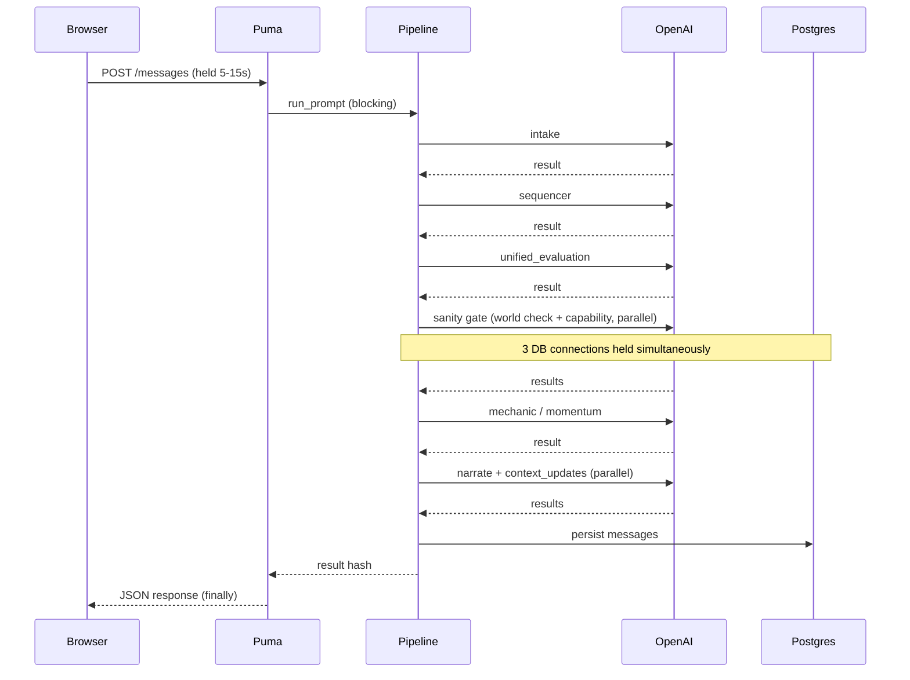
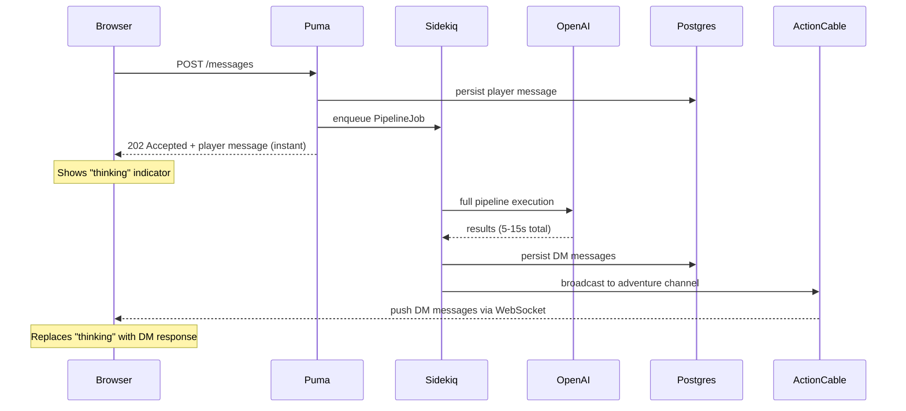

# Design Document: Async DM Pipeline via Sidekiq + ActionCable

## Problem Statement

The DM pipeline runs synchronously inside the HTTP request/response cycle. A single pipeline run takes 5-15 seconds (dominated by sequential and parallel OpenAI API calls) and holds a Puma thread hostage for the entire duration.

The pipeline spawns parallel Ruby threads for concurrent AI calls (sanity gate, output phase). Each thread needs its own ActiveRecord database connection. With the default pool of 5 and up to 3 concurrent threads, this can cause `ActiveRecord::ConnectionTimeoutError` under contention.

We raised the pool to 12, which fixes the immediate crash but introduces a deeper scaling constraint:

```
1 pipeline run = 1 Puma thread blocked for 5-15s
               + up to 3 DB connections at peak (main + 2 sanity gate threads)

12-thread Puma / 3 connections per pipeline = ~4 concurrent pipelines max
```

Beyond ~2 simultaneous players, the server either runs out of DB connections or out of Puma threads (starving all other HTTP requests including page loads, API calls, and health checks).

### Alternatives considered

**Porting DM logic to Node.js** — Node's event loop handles I/O-bound parallelism
natively (Promises instead of threads), which would eliminate the connection pool
problem. However, this would require a full pipeline rewrite (~2000 lines), a second
service to deploy, duplicated model access, and distributed tracing. The bottleneck
is not Ruby's threading model — it's that a synchronous HTTP request holds a Puma
thread hostage while waiting on OpenAI. The correct fix is to stop blocking the HTTP
request, not to change the language.

**Increasing Puma workers (cluster mode)** — Running multiple Puma processes with
`WEB_CONCURRENCY=4` would multiply available connections (4 × 12 = 48) and support
~4-6 concurrent pipelines. However, each worker copies the full Rails app (~150-300MB
RAM), and this still ties pipeline execution to the web request cycle — every pipeline
run blocks a Puma thread for 5-15 seconds.

### Current architecture



The browser's `fetch()` blocks for the entire pipeline duration. The "thinking" spinner in the UI is purely cosmetic — no intermediate feedback is possible.

---

## Chosen Solution: Sidekiq + ActionCable

Move the pipeline execution to a Sidekiq background worker. Return an immediate acknowledgment to the browser. Push results to the frontend via ActionCable WebSocket when the pipeline completes.

### Target architecture



### Why this solves the problem

- **Puma is freed immediately.** The HTTP request returns in <50ms instead of 5-15s. Puma threads serve other requests normally.
- **DB connections are isolated.** Sidekiq workers run in a separate process with their own connection pool. The pipeline's concurrent connections don't compete with web request connections.
- **Scales independently.** Add more Sidekiq workers to handle more concurrent pipelines without affecting web server capacity.
- **Better UX potential.** ActionCable enables future step-by-step streaming (e.g., show "Interpreting intent..." then "Rolling dice..." then final narrative).

---

## Implementation

### Infrastructure

- `redis` and `sidekiq` gems in Gemfile
- `config/sidekiq.yml` defines `dm_pipeline` priority queue
- `config/cable.yml` wired to Redis (`REDIS_URL`) in all environments
- Separate `worker` service in all Docker Compose files runs `bundle exec sidekiq`
- `active_job.queue_adapter = :sidekiq` set in both development and production environments

### Backend

- **`AdventureChannel`** — ActionCable channel scoped per adventure; authorises via `adventure.user_id == current_user.id || current_user.admin?`
- **`PipelineJob` / `RollPipelineJob` / `InitiativePipelineJob`** — Sidekiq jobs that run the pipeline and broadcast results
- **`DungeonMasterService`** exposes a two-phase async API: `prepare_*` (persist player message, return it for the 202) and `execute_*` (run pipeline in job, return DM messages for broadcast)
- **`AdventureMessagesController`** always calls `prepare_*` + `perform_later` and returns 202 — no sync path

### Frontend

- `useAdventureMessages` subscribes to `AdventureChannel` on mount via `@rails/actioncable`
- HTTP 202 returns immediately with the persisted player message; thinking indicator appears
- ActionCable delivers `pipeline_result` when the job completes — sentinel is replaced with real DM messages
- ActionCable delivers `pipeline_progress` during job execution — thinking indicator shows step-level status text (see Live Progress below)

### Connection pool

| Process | Pool Size | Peak Connections | Purpose |
|---------|-----------|-----------------|---------|
| Puma (web) | 5 | ~5 | Serve HTTP requests (fast, no pipeline) |
| Sidekiq (worker) | 12 | ~3 per pipeline | Run DM pipelines with parallel threads |

---

## Live Progress Feedback

While a pipeline job runs, step modules broadcast incremental status messages to the player's UI. This replaces the generic thinking dots with live text that updates as the pipeline advances.

### How it works

Each pipeline step that has a meaningful player-facing status calls `broadcast_progress("message")` at its entry point:

```ruby
# e.g. in steps/unified_evaluation.rb
def run_unified_evaluation(intention)
  broadcast_progress("Reading the situation...")
  # ...
end
```

`broadcast_progress` is defined in `Steps::Helpers` and calls `@on_progress&.call(message)`. The `@on_progress` callback is set by `DungeonMasterService` when it constructs the pipeline:

```ruby
# dungeon_master_service.rb
def pipeline
  @pipeline ||= DungeonMaster::Pipeline.new(
    ...,
    on_progress: method(:broadcast_pipeline_progress))
end

def broadcast_pipeline_progress(message)
  AdventureChannel.broadcast_to(@adventure, { type: "pipeline_progress", message: message })
end
```

The frontend `useAdventureMessages` hook handles `pipeline_progress` events by patching the content of the thinking sentinel in place, so the status text appears beneath the animated dots.

### Current progress messages

| Step | Message |
|------|---------|
| `UnifiedEvaluation` | "Reading the situation..." |
| `Chronicler` | "Consulting the chronicle..." |
| `Narrate` | "Writing the story..." |
| `ContextUpdate` | "Remembering the world..." |

Steps that don't call `broadcast_progress` simply don't participate — fully opt-in. The callback is a no-op when `@on_progress` is not set (e.g. in tests), so no test changes are needed to add a new progress message.
