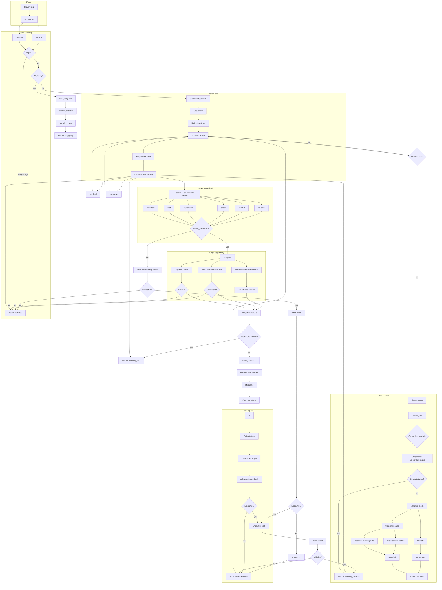
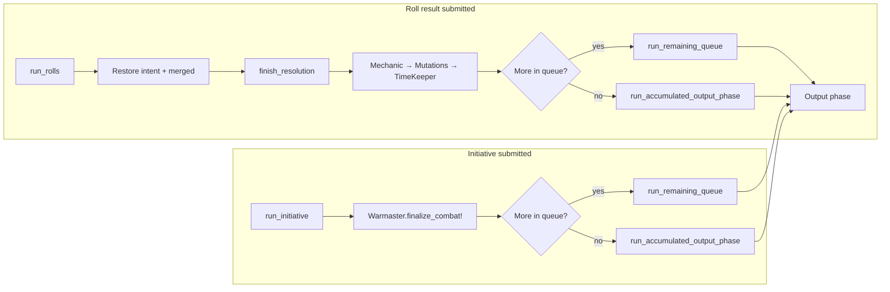

# Dungeon Master Pipeline — Flow Diagram

High-level flow of the AI DM pipeline. For step-by-step detail see [Pipeline Steps](pipeline_steps.md).

## Resumption flows

## Step summary

| Step | Purpose |
|------|--------|
| **Sanitize** | Score input safety; produce sanitized text. |
| **Classify** | Category: combat, traversal, social, exploration, rest, inventory, dm_query. |
| **Sequencer** | Split player message into discrete actions. |
| **Player Interpreter** | Per action: intent + context tags. |
| **Beacon** | Per domain (parallel): affected?, needs_mechanics?, rules_needed, transition, destination. |
| **Mechanical evaluation** | Per affected context: rolls, NPC actions, consequences, summary. |
| **Sanity checker** | World consistency + capability guardrail (parallel with mech eval). |
| **Mechanic** | Factual outcome + structured mutations from rolls + NPC results (mechanical path). |
| **Momentum** | Factual outcome + affected contexts for non-mechanical actions. |
| **TimeKeeper** | Estimate time → Harbinger (encounters) → GameClock advance. Stores journey_data on loop. |
| **Chronicler** | Plot/clue/NPC reaction brief for Narrate (if story data exists). Determines adventure_complete. |
| **Narrate** | Prose from outcome + contexts + dm_brief. Reads what_happened from loop. |
| **Micro context update** | Update affected + active context JSONBs. |
| **Macro narrative update** | Update story summary (if macro_significant). |

## Edge pipeline (alternative)

When `pipeline_mode: "edge"`, a single **Edge Pipeline** call replaces the full step sequence: one AI call handles sanitization, adjudication, narration, and state in one pass. See pipeline_steps.md for when to use it.
