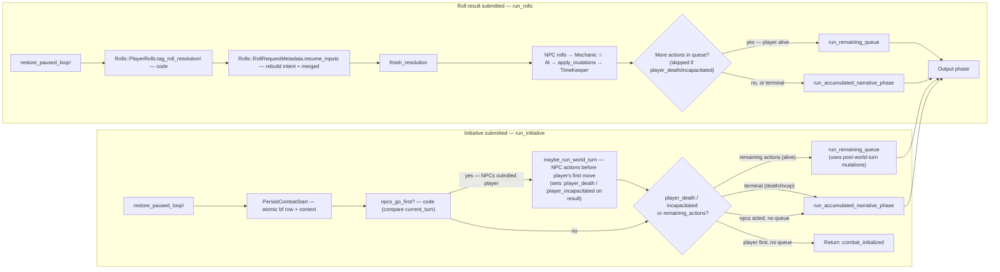

# Dungeon Master Pipeline — Flow Diagram & Comprehensive Reference

High-level flow of the AI DM pipeline. For per-step prompt/model detail see [Pipeline Steps](pipeline_steps.md).

> **Project moment (2026-05):** this document is a snapshot of the pipeline as it runs **today**. A GM-orchestrator step is the next major change — it will replace the fixed phase chain with a reasoning model that delegates to scoped specialist tools. Until that ships, the diagrams below describe live behavior. See `docs/design_philosophy.md` Project moment + §3 / §10 for the pivot rationale.

**Outer shell:** `PlayerTurn::Engine#run_prompt` runs two explicit phases in order ([`pipeline_engine.rb`](../app/services/player_turn/pipeline_engine.rb) — `Phases::IntakeDangerGate`, `Phases::OrchestrateCompoundActions`). Compound actions use **`Engine::ActionQueueRunner`** for the per-action loop shared with `run_remaining_queue` (fresh queue aborts on `:rejected`; resume skips rejected actions). The narrative/output path is **`run_accumulated_narrative_phase`** → **`run_narrative_phase`** (Stagehand). See [Outer orchestration](pipeline_steps.md#outer-orchestration-pipeline-class) in pipeline_steps.md.

---

## Main flow (run_prompt)

```mermaid
flowchart TB
    subgraph entry["Entry — PlayerTurn::Service"]
        A[Player Input] --> PRE0{Usage limit?}
        PRE0 -->|yes| ULIMIT[Return :usage_limit_exceeded]
        PRE0 -->|no| PRE1[Log abandoned pipeline?]
        PRE1 --> PRE2[Auto-finalize pending initiative?]
        PRE2 --> MODTRUST{"user.trusted?"}
        MODTRUST -->|"trusted"| MOD_ASYNC["ModerationCheckJob.perform_later\nstrikes/ban applied async — no pipeline delay"]
        MOD_ASYNC --> B[run_prompt]
        MODTRUST -->|"not trusted"| MOD_SYNC["ModerationService.call\nPOST /moderate → Node evaluator"]
        MOD_SYNC -->|"clean"| B[run_prompt]
        MOD_SYNC -->|"flagged"| MOD_BLOCK["increment strike\nauto-ban if strikes ≥ max_strikes\nReturn moderation_flagged message"]
    end

    subgraph controller_gate["Controller gate — AdventureMessagesController"]
        REQ[Incoming request] --> BAN_CHECK{"user.banned?"}
        BAN_CHECK -->|yes| BAN_RESP["403 + banned: true\n(all three actions: create / roll / initiative)"]
        BAN_CHECK -->|no| A
    end

    subgraph gate["Gate — Intake  ☆ AI"]
        B --> C[run_intake]
        C --> E{danger_score ≥ threshold?}
        E -->|yes| REJECT[Return :rejected]
        E -->|no| SEQ
    end

    subgraph seq_gate["Sequencer — conditional on action_queue toggle  ☆ AI"]
        SEQ[run_sequencer] --> SEQ1{Multiple actions?}
        SEQ1 -->|yes| SEQN["actions = [a1, a2, …aN]"]
        SEQ1 -->|no| SEQ2["actions = [input]"]
    end

    SEQN & SEQ2 --> ACTION_LOOP

    subgraph action_loop["Action loop — ActionQueueRunner (each action)"]
        ACTION_LOOP[Create AdventureLoop record] --> RESOLVE[AdventureLoopResolution.resolve]
    end

    subgraph resolve["AdventureLoopResolution.resolve — cast + evaluation + sanity gate"]
        RESOLVE --> COMBAT_BR{combat_active?}
        COMBAT_BR -->|yes| CRR["Steps::CombatRollRequest — single AI call ☆\n(attack options, action economy, threats, battlefield)\n+ Phases::CombatMechanicResolution post-call clamp\n+ optional target_actor_sheet_id from live combat roster"]
        COMBAT_BR -->|no| CAST["Steps::CastResolve — single AI call ☆\n(name+type+count of creatures in scene)\n+ code 4-tier lookup → PlayerTurn::CastRoster persisted on AdventureLoop"]
        CAST --> RR["Steps::RollRequest — single AI call ☆\n(top-K rules + scene beats from pgvector + cast roster)\nemits optional target_actor_sheet_id (id from roster)\n+ orthogonal transition signal"]
    end

    CRR & RR --> SANITY_GATE

    subgraph sanity_gate["Sanity gate"]
        SANITY_GATE --> SKIP_W{skip_world_sanity_check?}
        SKIP_W -->|yes| FG3[capability_check  ☆ AI]
        SKIP_W -->|no| FG2[world_consistency_check  ☆ AI\n+ capability_check  ☆ AI\nin parallel via /fan_out]
        FG2 -->|not consistent| REJECT
        FG2 -->|consistent| FG3_CHECK
        FG3 --> FG3_CHECK
    end

    FG3_CHECK{capability allowed?}
    FG3_CHECK -->|no| REJECT
    FG3_CHECK -->|yes| MERGE[build_merged_from_result — code\n+ deduplicate_rolls + filter_auto_success_rolls + assign_request_ids]
    MERGE --> ROLLCHECK{Player rolls still needed?}
    ROLLCHECK -->|yes| PAUSE_ROLLS[Return :awaiting_rolls]
    ROLLCHECK -->|no| FINISH_RES

    subgraph finish_res["finish_resolution — after rolls or auto-success"]
        FINISH_RES{combat_active?}
        FINISH_RES -->|yes| COMBAT_GM[run_combat_gm  ☆ AI]
        FINISH_RES -->|no| MECHANIC[run_mechanic  ☆ AI\nhandles no-roll resolution with rolls: []]
        COMBAT_GM --> APPLY_MUT[apply_mutations  — code]
        MECHANIC --> APPLY_MUT
        APPLY_MUT --> TK_MECH[run_time_keeper]
    end

    subgraph timekeeper["TimeKeeper — code-first estimation, then Harbinger"]
        TK_MECH --> TK1["estimate_time: journey? → code\ncombat? → code\nrest? → code\ntake_20? → code\nelse → AI ☆"]
        TK1 --> TK2[consult_harbinger_if_needed — code + optional AI ☆]
        TK2 --> TK3[GameClock.advance_clock!  — code]
        TK3 --> TK4[check_thresholds + apply_fatigue_conditions  — code]
        TK4 --> ENC_CHECK{encounter triggered?}
    end

    ENC_CHECK -->|yes| WARMASTER_A[Warmaster Path A — from Harbinger]
    ENC_CHECK -->|no| NENC

    subgraph warmaster_a["Warmaster Path A — encounter table creature spawn"]
        WARMASTER_A --> WA1[initialize_from_encounter!]
        WA1 --> WA2{Creatures spawned?}
        WA2 -->|yes| WA3[roll creature initiatives  — code]
        WA3 --> PAUSE_INIT[Return :awaiting_initiative]
        WA2 -->|no| ENC_STATUS[status: :encounter — breaks queue]
    end

    NENC --> MECH_RESOLVED["status: :resolved\n(from finish_resolution)"]

    MECH_RESOLVED --> WT_CHECK

    subgraph world_turn["World Turn — combat-only post-resolution phase"]
        WT_CHECK{combat active?}
        WT_CHECK -->|yes| WORLD_TURN["maybe_run_world_turn — code"]
        WORLD_TURN --> WT_ORCH["Shared-snapshot world-turn orchestration — code"]
        WT_ORCH --> NPC_ACTION["npc_action ×N — AI parallel /fan_out"]
        NPC_ACTION --> WT_DICE["Sequential code: dice + mutations in initiative order"]
        WT_DICE --> WT_ADV["combat_state_advancement + combat end check — code"]
        WT_ADV --> LOOP_OUTCOME
        WT_CHECK -->|no| LOOP_OUTCOME
    end

    subgraph loop_outcomes["Action loop outcome dispatch"]
        LOOP_OUTCOME{result.status?}
        LOOP_OUTCOME -->|:rejected| REJECT_EARLY[Return :rejected — pipeline ends]
        LOOP_OUTCOME -->|:awaiting_rolls| PAUSE_ROLLS_OUT[Return :awaiting_rolls — pipeline pauses]
        LOOP_OUTCOME -->|:awaiting_initiative| PAUSE_INIT_OUT[Return :awaiting_initiative — pipeline pauses]
        LOOP_OUTCOME -->|:encounter| BREAK_ENC[break action queue → output phase]
        LOOP_OUTCOME -->|:resolved| ACCUMULATE[accumulate result]
        LOOP_OUTCOME -->|":resolved + action_queue progressive"| PROGRESSIVE_NARRATE["run_single_action_narrative_phase\n+ on_narrative callback"]
        PROGRESSIVE_NARRATE --> ACCUMULATE
    end

    ACCUMULATE --> INTER_CTX{More actions in queue?}
    INTER_CTX -->|yes| CTX_UPDATE[run_inter_action_context_update  ☆ AI]
    CTX_UPDATE --> ACTION_LOOP
    INTER_CTX -->|no| OUTPUT_PHASE

    BREAK_ENC & MECH_RESOLVED --> OUTPUT_PHASE

    subgraph output_phase["Narrative phase — run_accumulated_narrative_phase → run_narrative_phase"]
        OUTPUT_PHASE --> STAGEHAND[run_output_phase — Stagehand]
        STAGEHAND --> COMBAT_CHECK{RollRequest signaled\ncombat_started?}
        COMBAT_CHECK -->|yes| WARMASTER_B[Warmaster Path B — from cast roster]
        WARMASTER_B --> WB1[persist_combat_from_cast_roster!  — code\ncombatants = target_actor_sheet_id + pre-existing hostiles]
        WB1 --> WB2{Combatants picked?}
        WB2 -->|yes| WB3[roll initiatives from existing creature sheets — code]
        WB3 --> PAUSE_INIT_B[Return :awaiting_initiative]
        WB2 -->|no| NARRATE_PHASE
        COMBAT_CHECK -->|no| NARRATE_PHASE

        subgraph narrate_phase["Output phase — two-stage"]
            NARRATE_PHASE --> PAR_NARRATE["Narrative fan-out (sync)\nrun_narrate  ☆ AI\n+ run_context_update  ☆ AI"]
            PAR_NARRATE --> MASTERS_ASYNC["Masters fan-out (async Sidekiq)\nrun_loremaster  ☆ AI\n+ run_social_master  ☆ AI\n+ run_geomaster  ☆ AI"]
        end
    end

    PAR_NARRATE --> OUT_NARR[Return :narrated]
    PROGRESSIVE_NARRATE -.->|"all actions done"| OUT_SEQ["Return :narrated_sequence\n(progressive narration path)"]
```

---

## Resumption flows



---

## Comprehensive Pipeline Explanation

### Overview

The DM pipeline is a multi-step orchestration system that translates a player's free-form text input into a game outcome: narrative prose, dice roll requests, initiative prompts, or outright rejections. It runs exclusively as an **asynchronous Sidekiq job**: the HTTP request returns 202 immediately, the pipeline executes in the background, and results are delivered to the player via an ActionCable WebSocket. There is no synchronous path.

The rest of this document covers the budget pipeline.

---

### Live progress feedback

While a job runs, the player sees incremental status messages beneath the
animated thinking dots instead of a static spinner. Each AI-heavy step
calls `broadcast_progress("message")` at its entry point:

```ruby
def run_roll_request(intention)
  broadcast_progress("Reading the situation...")
  # ...
end
```

`broadcast_progress` is a helper in `Steps::Helpers` that invokes an
`@on_progress` callback when present. `PlayerTurn::Service` wires that
callback to `AdventureChannel.broadcast_to`, which pushes a
`pipeline_progress` WebSocket event to the player's browser. The
`useAdventureMessages` hook patches the content of the thinking sentinel
in place so the status line animates in without replacing the dots.

| Step | Message shown to player |
|------|------------------------|
| `RollRequest` | "Reading the situation..." |
| `CombatRollRequest` | "Adjudicating your move..." |
| `Narrate` | "Writing the story..." |

The callback is a no-op when `@on_progress` is not set (tests, console
runs), so adding a new progress call to a step requires no test changes.

---

### Pre-flight checks (before run_prompt)

A controller-level ban gate runs first, then four checks inside `PlayerTurn::Service#execute_prompt` before the pipeline proper:

**Controller gate (`AdventureMessagesController#check_ban`)** — If `current_user.banned?`, all three actions (`create`, `roll`, `initiative`) return 403 immediately with `{ banned: true }`. No player message is persisted, no job is enqueued.

1. **Usage limit** — Raises `UsageLimitExceeded` if the user has hit their quota. Returns a `usage_limit` system message.

2. **Abandoned pipeline log** — Detects if the previous pipeline was paused (a `roll_request` or `initiative_request` message exists) but the player submitted a new free-text message instead of the expected roll/initiative. Logs a `pipeline_abandoned` event for observability. Does **not** block the pipeline — the new message is processed normally.

3. **Auto-finalize pending initiative** — If an `initiative_request` message exists but the player's most recent response was a new free-text action (not an `initiative_result`), the pipeline auto-rolls the player's initiative using their DEX modifier and calls `Warmaster.finalize_combat!`. This silently resolves combat initialization so the new action can proceed with an active `combat_context`.

4. **Moderation gate** — POSTs the player's raw input to the Node evaluator's `POST /moderate` endpoint (OpenAI `omni-moderation-latest`). Behaviour depends on whether the user is trusted:
   - **Regular users (blocking):** if the input is flagged, a `ModerationEvent` is recorded, `moderation_strikes` is incremented, and the pipeline short-circuits — returning a `moderation_flagged` DM message without starting a pipeline run. If `moderation_strikes >= max_strikes` the user is automatically banned and `trusted` is revoked.
   - **Trusted users (async):** `ModerationCheckJob` is enqueued via Sidekiq; the pipeline proceeds immediately with no added latency. Strikes and bans still apply after the fact. The user remains trusted until strikes hit the threshold, at which point trust is auto-revoked alongside the ban.
   - If `moderation.enabled` is `false` in `config/moderation.yml`, this entire gate is skipped.

---

### Step 1 — Intake (AI)

The first AI call. Every message passes through this gate.

**What it does:**
- Scores the input for **prompt injection and meta-gaming** on a 0–10 danger scale.
- **Sanitizes** the input (strips OOC formatting, normalizes phrasing).
- Detects **DM queries** (player asking the DM a lore/rules question rather than acting).
- Flags potential **context domain gaps** (e.g., entering a new area type not in any existing context).

**Early exits:**
- If `danger_score >= config.danger_threshold` → pipeline halts, returns `{ action: :rejected }` immediately. No message is shown to the player except the reason from Intake.
- If `sanitized_input` is blank → raises `AiError`, caught by the service layer and turned into a "DM distracted" system message.

**Side effect:** Creates an `ExperienceSuggestion` record if Intake detected a possible new context domain to add to the story setup. This is observability-only and does not affect pipeline execution.

---

### Step 2 — Sequencer (AI, conditional)

Only runs if `DmConfig["action_queue"]` is enabled. Otherwise, returns the sanitized input as a single-element array.

**What it does:** Detects compound inputs ("I pick the lock, then open the door, then search the room") and splits them into an ordered array of discrete action strings. A single action returns `["input"]`. If the AI call fails, falls back to `[sanitized_input]`.

The resulting `actions` array drives the **action queue loop**.

---

### Step 3 — Action queue loop

The outer orchestration loop: for each action in the queue:

1. Creates an `AdventureLoop` record (tracks status, timeline events, raw outcome).
2. Calls **AdventureLoopResolution.resolve** — the inner pipeline (detailed below), passing the sanitized action text directly.
3. Dispatches on the result status (see "Outcomes" section).

**Inter-action context update:** When an action resolves (`:resolved` status) and there are more actions still in the queue, a `run_inter_action_context_update` call runs immediately before the next action. This refreshes `combat_context` and `scene_summary` so the next action's evaluation sees the freshest combat state.

---

### Step 4 — AdventureLoopResolution.resolve

The inner pipeline entry point. Dispatches deterministically on combat state:

- **Out of combat → `Steps::CastResolve` then `Steps::RollRequest`** —
  two AI calls. CastResolve runs first: the AI emits
  `[{name, type, count}]` against a closed five-entry type enum and code
  resolves each entry through the four-tier deterministic lookup
  (existing AdventureNpc → existing AdventureActorSheet → BestiaryEntry by name
  → BestiaryEntry by `default_for_type`). The resulting
  `PlayerTurn::CastRoster` is persisted on the AdventureLoop so it
  survives `RollPipelineJob`'s pause/resume cycle.

  RollRequest then runs as a single AI call. Top-K rules retrieved from
  `rule_embeddings` via `Rules::Lookup`; top-K narrative beats retrieved
  from `adventure_narrative_facts` via `Lore::FactsLookup`. The cast
  roster is rendered as `[id=N] Name (attitude) — at <loc>` and joined
  to the prompt. The model emits one roll spec (or "no roll") plus the
  optional `target_actor_sheet_id` (an integer copied verbatim from
  the cast roster — omitted when there is no target) and the orthogonal
  `transition` signal.
- **Combat-active → `Steps::CombatRollRequest`** — single AI call. Same
  shape as RollRequest, plus combat-aware context: legal attack options
  (computed pre-call by `Combat::AttackOptionBuilder`), action economy,
  AoO threats from `Combat::Rules.aoo_threats_against`, and the
  battlefield slice. Combat rolls emit `attack_option_id` (never DC) for
  attack rolls and `dc_formula` for saving throws; DCs and damage are
  resolved post-call by `Phases::CombatMechanicResolution` from the
  sheet + grid. Free-text rolls share the same optional
  `target_actor_sheet_id` contract as out-of-combat RollRequest,
  sourced from the live combat roster.

Both steps return an `EvaluationResult` value object holding
`intention`, `destination`, `transition`, `target_actor_sheet_id`
(optional), `player_rolls`, `consequences`, `mechanical_summary`, plus
the `combat_starting?` predicate. Identity is owned by code from the
moment the cast roster is built; RollRequest never invents a creature
name.

Opposed roll DCs (Stealth vs Perception, Bluff vs Sense Motive, etc.)
are resolved post-call by `Mechanics::OpposedRollResolution` from the
target's sheet — the AI is asked to omit `dc` for opposed rolls and is
overridden with the code-resolved value if it emits one anyway (the
override is reported to Sentry as `opposed_roll_dc_conflict` so prompt
quality regressions stay visible).

The previous 3-phase ParallelEvaluation chain (beacon → mechanical_evaluation
→ roll_qualifier via the Node evaluator's `/fan_out` and `/sequential`)
has been retired — see Decision 4.

---

### Step 5 — Sanity gate + resolution

After RollRequest / CombatRollRequest emits the spec, the **sanity gate** validates the action before any mechanics are resolved. There is no longer a domain-aware split between "mechanical" and "no-domain" paths — every action goes through the gate, then through Mechanic (or Combat GM in active combat). No-roll actions resolve through Mechanic with `rolls: []`.

Its behaviour depends on the adventure's `skip_world_sanity_check` flag:

**Default (skip_world_sanity_check = false):** two checks run in parallel, then evaluation results are merged:

| Thread | Step | Type |
|--------|------|------|
| world_thread | World consistency check | AI |
| cap_thread | Capability check | AI |

**When skip_world_sanity_check = true:** the world thread is skipped entirely. Only the capability check runs (no parallelism needed).

**World consistency check** — AI. Validates that entities, targets, and objects the player references actually exist in the current scene. Receives `scene_summary`, `combat_context`, retrieved NPCs / locations / facts (top-K from the pgvector stores via `Lore::FactsLookup` / `Lore::NpcsLookup` / `Lore::LocationsLookup`). Returns `{ consistent: bool, reason: string, dm_message: string }`. Skipped when `skip_world_sanity_check` is set on the adventure.

**Capability check** — AI. Validates the player actually has the spell, feat, or item they're attempting to use. Returns `{ allowed: bool, reason: string }`. Always runs regardless of `skip_world_sanity_check`.

**Early exits from sanity gate:**
- World check fails → `:rejected` (optionally with a `dm_message` shown as narrative prose instead of a system error). Never reached when skipped.
- Capability check fails → `:rejected`.

**Post-gate processing (code), in `build_merged_from_result`:**

1. Flattens the EvaluationResult's `player_rolls` / `consequences` / `mechanical_summary` into the merged hash that finish_resolution / Mechanic / Combat GM consume.
2. `Rolls::PlayerRolls.deduplicate_rolls!` — defensive observability. With single-call RollRequest the model emits at most one roll, so cross-domain duplicates are no longer a structural risk; if a duplicate slips through, a warning lands in play_log and nothing is silently rewritten.
3. `Rolls::PlayerRolls.filter_auto_success_rolls!` — removes rolls the character cannot possibly fail: DC ≤ 0, skill modifier + 1 ≥ DC. Attack rolls are preserved (they never auto-succeed). Logs removed rolls for visibility.
4. `Rolls::PlayerRolls.assign_request_ids!` — every roll gets a stable UUID for the awaiting-rolls pause/resume contract.

**If any player rolls remain** → returns `{ status: :awaiting_rolls }`. Pipeline pauses.

**If no player rolls remain** (all were auto-successes, or NPC-only) → proceeds directly to `finish_resolution` with an auto-success message.

---

### Step 6 — finish_resolution (post-roll or auto-success)

Runs after the player submits dice results, or immediately when auto-success is detected.

1. **run_mechanic / run_combat_gm** (AI) — Non-combat resolutions use Mechanic. Active combat routes through Combat GM, which owns combat-specific outcome synthesis and battlefield/action-economy patches.
2. **apply_mutations** (code) — Applies `mutations` to the character sheet and creature sheets immediately. Handles HP changes, condition additions/removals, item consumption, location transitions.
3. **run_time_keeper** — See dedicated section. Runs after mutations, so combat-aware time checks use canonical post-mutation state.
4. **maybe_run_world_turn** — In active combat, code-owned World Turn resolves routine NPC initiative turns after the player's action, advances combat state, and can short-circuit on player death/incapacitation or combat end.

Returns `{ status: :resolved }` or `{ status: :awaiting_initiative }` or `{ status: :encounter }`.

---

### Time mechanics — TimeKeeper + Harbinger + GameClock

**TimeKeeper** runs on every resolved action. It is a three-stage process:

#### Stage 1 — Time estimation (code-first priority)

Estimation uses this waterfall, short-circuiting at the first match:

| Condition | Method | Formula |
|-----------|--------|---------|
| Destination known (RollRequest emitted `destination`) | Code | `distance_miles / speed_mph` (from character speed + terrain modifier) |
| Combat active (`combat_context.active = true`) | Code | 6 seconds = 0.0017 hours per round |
| Intention mentions rest/sleep/camp | Code | Short rest → 1h, Long rest → 8h |
| `@loop` tagged `took_20` | Code | 0.67 hours (~40 minutes) |
| Everything else | AI call | `time_keeper` prompt; clamps 0–720h |

Journey speed is computed from the character's base speed (ft/round), converted to mph, then multiplied by a terrain modifier from `DmConfig["terrain_speed_modifiers"]`.

#### Stage 2 — Harbinger consultation (code + optional AI)

Harbinger is **skipped** if:
- Combat is currently active.
- Estimated hours < 0.01 (negligible time).
- No encounter table exists for the story.
- `hours_since_last_encounter_check + estimated_hours < table.check_frequency_hours` (time threshold not yet reached).

When Harbinger runs, it simulates the passage in frequency-sized segments, rolling against the encounter table for each segment. If an encounter triggers:
- Fewer hours than requested are granted (encounter happened mid-way).
- `expand_encounter` is called: if the encounter table entry is "fixed" (has a description), it's used directly. Otherwise, an AI call generates the encounter scene, creature list, and new world elements.
- Encounter data (`encounter_entry_id`, `encounter_creatures`, `encounter_scene`) is stored in the `AdventureLoop` for Warmaster and Narrate to consume.

If 8+ hours pass on a journey without rest, Harbinger returns `:rest_needed` (fatigue interrupts travel).

#### Stage 3 — GameClock advance (code)

`GameClock.advance_clock!` updates `adventure.time_context`:
- `current_hour` — advances with overflow to next day(s).
- `adventure_day` — increments by days elapsed.
- `light_conditions` — derived from current hour: dawn (5–6), day (7–17), dusk (18–19), night (else).
- `hours_since_last_rest` — accumulated until a rest action resets it.
- `hours_since_last_encounter_check` — reset to 0 when Harbinger was consulted; otherwise accumulated.

If the action was a rest, `rest_clears_fatigue` is set in the time context.

`check_thresholds` and `apply_fatigue_conditions` then evaluate `hours_since_last_rest`:
- ≥ 16 hours → applies `fatigued` condition to the character sheet.
- ≥ 32 hours → applies `exhausted`.
- After a rest → removes both.

All character sheet condition changes call `recompute_derived_stats!`.

---

### Combat initialization — Two Warmaster paths

Combat can start in two fundamentally different ways:

#### Path A — Harbinger encounter table

Triggered when TimeKeeper's Harbinger rolls an encounter. The encounter table entry is retrieved from `@loop` (stored by Harbinger's `expand_encounter`). If the entry has a creature manifest (deterministic spawn list), creatures are spawned from it. If not but `encounter_creatures` was set by the AI expansion, those are used. Otherwise, spawning is aborted and the pipeline returns `{ status: :encounter }` (no initiative requested).

#### Path B — RollRequest combat-started transition (Stagehand)

Triggered during the output phase when Stagehand detects that RollRequest emitted `transition: "combat_started"` (or any `_to_combat` value). This handles narrative-originated combat: the player's description triggered a fight without an encounter table roll. Combatants are picked deterministically from the `PlayerTurn::CastRoster` already attached to the AdventureLoop — `Warmaster.persist_combat_from_cast_roster!` takes the action's `target_actor_sheet_id` (the creature the player aimed at) plus any cast-roster entries already marked `hostile`. Indifferent / friendly bystanders stay out of combat.

There is no name-fuzzy-matching, no `initialize_from_names!`, and no per-turn AI generation on this path — every combatant is a real `actor_sheet_id` minted by the upstream `CastResolver` step.

In both paths, `Warmaster`:
1. Resolves each combatant to an existing `AdventureActorSheet` (Path A from the `EncounterTableEntry#manifest`'s bestiary IDs, Path B from the cast roster's already-minted sheets).
2. Rolls each creature's initiative (d20 + DEX modifier, +4 for Improved Initiative feat).
3. Returns `{ status: :awaiting_initiative, creature_data: [...] }`.

The pipeline pauses, saves creature data + intent + mutations + remaining queue into the `initiative_request` message metadata. When the player submits their initiative roll, `run_initiative` is called, `Warmaster.finalize_combat!` sets `adventure.combat_context` with sorted turn order, and the queue resumes.

**If no creatures could be spawned** (all lookups failed), Path A returns `{ status: :encounter }` which breaks the action queue but doesn't pause for initiative. The encounter is narrated but no combat_context is created.

---

### Action queue outcomes

After `AdventureLoopResolution.resolve` returns, the action loop dispatches on `result[:status]`:

| Status | Behavior |
|--------|----------|
| `:rejected` | **Returns immediately** — pipeline ends. If `dm_message` is present, it's shown as DM prose; otherwise a system message. |
| `:awaiting_rolls` | **Returns immediately** — pipeline pauses. Serializes `intent`, `merged` (roll requests + NPC actions + consequences + summaries), and `remaining_actions` into the `roll_request` message metadata. |
| `:awaiting_initiative` | **Returns immediately** — pipeline pauses. Serializes `creature_data`, `intent`, `mutations`, and `remaining_actions` into the `initiative_request` metadata. |
| `:encounter` | **Breaks the action queue.** Remaining actions in the queue are discarded. Proceeds to output phase with encounter status. |
| `:resolved` | **Accumulates** result. Runs inter-action context update if more actions follow. Continues to next action. |

---

### Narrative phase — `run_accumulated_narrative_phase` → `run_narrative_phase`

After all actions complete (or the queue breaks), `run_accumulated_narrative_phase` merges results and calls Stagehand’s **`run_narrative_phase`** (combat check, then a two-phase output: synchronous narrative fan-out for Narrate + CombatContextUpdate, followed by an async masters fan-out for Loremaster + SocialMaster + Geomaster via `GameMasterLoremasterJob`).

Multiple resolved/encounter results are **merged**: intentions concatenated with "; ", `macro_significant` or-ed. The combined narration seed is assembled by querying all `AdventureLoop` rows for the current `registry_entry_uuid` in `sequence_index` order and joining their `pipeline_outcome` fields with `"\n\nThen: "`.

#### Stagehand (Path B combat check)

Stagehand always runs the synchronous narrative fan-out first (Narrate + CombatContextUpdate) — the player gets the hit / Stealth / etc. outcome prose. Then it enqueues the async masters fan-out (Loremaster + SocialMaster + Geomaster) via `GameMasterLoremasterJob`, fed by Narrate's output. After that, if the most recent action's evaluation signaled a combat transition (`combat_started`, `*_to_combat`) and no combat is already active, Stagehand calls `Warmaster.persist_combat_from_cast_roster!` and emits the awaiting-initiative hand-off as a follow-up message. The "Roll for initiative!" system message rides on top of the narrative, not in lieu of it.

#### Two-phase output

The output phase runs in two stages (see `docs/pipeline_steps.md` Decision 28):

1. **Narrative fan-out (synchronous):** Narrate + CombatContextUpdate
   run concurrently inside one `POST /fan_out` call to the Node
   evaluator. The player waits for this — it produces the narrative.
2. **Masters fan-out (async):** Loremaster + SocialMaster + Geomaster
   are enqueued as a `GameMasterLoremasterJob` (Sidekiq) with Narrate's
   output as input. The player gets the textbox back immediately after
   stage 1. Both the legacy Stagehand path and the GM-flag path use the
   same job.

#### Narrate (AI)

The prose generator. Receives: story title/hook, story summary, `combat_context`, `time_context` (current hour, adventure day, light conditions), `what_happened` (from `@loop.verdict_outcome`), the combined narration seed (assembled from `pipeline_outcome` across all loop rows sharing this `registry_entry_uuid`), retrieved `scene_facts` from `adventure_narrative_facts` (outcome-keyed via `SceneFacts::ForOutcome`), forbidden_elements, journey data, encounter scene/creatures, pacing instructions, and directed play instructions.

Has a special fallback: if the model returns raw text instead of JSON, the text is treated as the narrative directly (`fallback_as: :dm_response`).

#### CombatContextUpdate (AI, in narrative fan-out)

Writes `combat_context` (when combat is active or transitioning) and the player-facing `scene_summary`. Also updates `scene_history` (ring-buffered to `scene_history_depth` entries, default 10) for the world consistency check.

#### Loremaster (AI, in async masters fan-out)

Sole writer of `adventure_narrative_facts`. Reads Narrate's output plus retrieved facts; emits new `event` / `state` / `entity` facts. See `pipeline_steps.md` Decision 37 for the lossy-with-Sentry contract.

#### SocialMaster (AI, in async masters fan-out)

Runtime NPC extraction from Narrate's output. Emits structured NPC records that are deduplicated by `Lore::RuntimeEntityFilter` (against existing `adventure_npcs` and within the same response) and normalized by `Lore::RuntimeEntityCoercer` before persisting via `Lore::ApplyNpcs` with `source: "runtime"`.

#### Geomaster (AI, in async masters fan-out)

Runtime location extraction from Narrate's output. Same dedup/normalize pipeline as SocialMaster, persisting via `Lore::ApplyLocations` with `source: "runtime"`.

---

### Resumption flows

**Roll resumption (`run_rolls`):**

1. `restore_paused_loop!` — finds the most recent paused `AdventureLoop` for this registry entry (`registry_entry_uuid`).
2. `Rolls::PlayerRolls.tag_roll_resolution!` — tags the loop with `took_20`, `took_10`, or `rolled`.
3. `Rolls::RollRequestMetadata.resume_inputs` (via `restore_roll_pause_inputs`) — reconstructs `intent` and `merged` from the `roll_request` message metadata.
4. `finish_resolution` — runs NPC actions → Mechanic → mutations → TimeKeeper.
5. If more actions were in the queue (`remaining_actions`), runs `run_remaining_queue` (same `ActionQueueRunner` loop as the fresh compound-action path). Otherwise, runs `run_accumulated_narrative_phase`.

**Initiative resumption (`run_initiative`):**

1. `restore_paused_loop!` — finds the paused loop.
2. `Battlefield::PersistCombatStart.call` — atomic: archives any stale active battlefield rows, creates a fresh battlefield row seeded with `scene_summary` + `current_location`, writes `combat_context` with sorted turn order + `battlefield_ref`.
3. **NPCs-go-first check:** if `current_turn != "Player"` (NPCs outrolled the player on initiative), `maybe_run_world_turn` runs immediately — NPC actions resolve before the player's first move. World turn enriches `result[:mutations]` and sets `:player_death` / `:player_incapacitated` on the result if needed.
4. If remaining actions exist and the player is alive → `run_remaining_queue` with **post-world-turn** `result[:mutations]` (not the pre-world-turn base). If the player is dead/incapacitated → `run_accumulated_narrative_phase` regardless of queue. If no remaining actions → `run_accumulated_narrative_phase` (when NPCs acted) or silent `:combat_initialized` return (when player goes first).

In both resumptions, the output phase reads `pipeline_outcome` from all `AdventureLoop` rows for the current `registry_entry_uuid` — no in-memory seed accumulation is needed across the pause boundary.

---

### What is AI vs. what is code

| Component | AI? | Notes |
|-----------|-----|-------|
| Intake | ✅ AI | Danger scoring, sanitization, DM query detection |
| Sequencer | ✅ AI | Action splitting (skipped if `action_queue` off) |
| CastResolver | ✅ AI ×1 + ❌ code 4-tier lookup | Out-of-combat. Names every creature in the scene as `[{name, type, count}]` against a closed five-entry type enum; code resolves each entry against existing AdventureNpc → existing AdventureActorSheet → BestiaryEntry by name → BestiaryEntry by `default_for_type`. Output `PlayerTurn::CastRoster` is persisted on the AdventureLoop |
| RollRequest | ✅ AI ×1 | Out-of-combat single call. Top-K rules + cast roster + scene beats from pgvector; no character block. Emits one roll spec (or "no roll") plus optional `target_actor_sheet_id` (id from the cast roster) and orthogonal `transition` signal. Opposed-roll DCs are resolved post-call from the target sheet by `Mechanics::OpposedRollResolution` |
| CombatRollRequest | ✅ AI ×1 + ❌ code clamping (`Phases::CombatMechanicResolution`) | Combat-active free-text. Carries attack options, action economy, threats, battlefield text. Emits `attack_option_id` (never DC); Ruby resolves attack mode, defense kind, damage metadata, and DCs from the sheet. Free-text rolls share the same optional `target_actor_sheet_id` contract sourced from the live combat roster |
| Combat::PlayerActionResolver | ❌ Code | Deterministic Combat HUD path: server-authoritative attack / move / end-turn |
| Combat::NpcTurn | ❌ Code | Per-NPC turn engine driven off `behavior_policy` (no AI call per NPC) |
| World consistency check | ✅ AI | Scene/entity validation |
| Capability check | ✅ AI | Spell/feat/item ownership |
| Mechanic | ✅ AI | Post-roll arbitration + mutations. Also handles no-roll resolution with `rolls: []`. |
| World Turn (orchestration) | ❌ Code | Shared-snapshot NPC orchestration, sequential code resolution (dice + mutations), combat advancement, and combat-end handling after a player action resolves in active combat |
| npc_action | ✅ AI ×N | Per-NPC combat action decisions during world turn. All acting NPCs are evaluated in one parallel Node `/fan_out` batch against the same live combat snapshot; code then resolves and applies in initiative order (early-stop if combat ends) |
| TimeKeeper (journey, combat, rest, take_20) | ❌ Code | Deterministic formulas |
| TimeKeeper (freeform) | ✅ AI | Fallback when no code rule matches |
| Harbinger | ❌ Code + optional AI | Dice rolls against table; AI for scene expansion only |
| GameClock | ❌ Code | Pure arithmetic |
| Auto-success filter | ❌ Code | Math against character sheet |
| apply_mutations | ❌ Code | Structured writes to DB |
| resolve_npc_actions | ❌ Code | Dice rolling |
| Warmaster combatant selection (Path B) | ❌ Code | Picks `target_actor_sheet_id` + pre-existing hostiles from the cast roster (no name-fuzzy matching, no per-turn AI) |
| Warmaster creature spawn (Path A — encounter manifest) | ❌ Code | `EncounterTableEntry#manifest` carries bestiary IDs; the bridge mints sheets via `Encounters::ActorSheetCreation.from_bestiary` |
| `creature_generation` AI step | ✅ AI (authoring-time only — `pipeline: false`) | Runs from `Authoring::AuthorStoryNpcSheet` to draft a `BestiaryEntry` for a named StoryNpc, gated by human review. Never invoked on the runtime player-turn path |
| Warmaster initiative rolls | ❌ Code | d20 + DEX modifier |
| Warmaster finalize_combat! | ❌ Code | Sorts initiative order |
| Narrate | ✅ AI | Prose generation (synchronous narrative fan-out — player waits) |
| CombatContextUpdate | ✅ AI | Updates `combat_context` and `scene_summary` (synchronous narrative fan-out — parallel with Narrate) |
| Loremaster | ✅ AI | Writes durable facts to `adventure_narrative_facts`; sole writer (async masters fan-out — player does not wait) |
| SocialMaster | ✅ AI | Runtime NPC extraction from Narrate output → `adventure_npcs` via `Lore::ApplyNpcs` (async masters fan-out) |
| Geomaster | ✅ AI | Runtime location extraction from Narrate output → `adventure_locations` via `Lore::ApplyLocations` (async masters fan-out) |

---

### Early exits and pipeline pauses — summary

| Trigger | Type | What returns |
|---------|------|-------------|
| User is banned (controller layer) | Hard stop | 403 — `{ banned: true }` — no message persisted, no job enqueued |
| Moderation flags input — non-trusted user | Hard stop | `moderation_flagged` DM message — pipeline never starts; strike incremented; auto-ban if at threshold |
| Usage limit exceeded | Hard stop | `:usage_limit_exceeded` system message |
| Intake danger score ≥ threshold | Hard stop | `:rejected` — reason from Intake |
| Intake: no sanitized_input | Hard stop → error | "DM distracted" system message |
| World consistency check fails | Hard stop | `:rejected` — optionally with dm_message |
| Capability check fails | Hard stop | `:rejected` |
| Player rolls needed | **Pause** | `:awaiting_rolls` — state in message metadata |
| Initiative needed (Path A or B) | **Pause** | `:awaiting_initiative` — state in metadata |
| Encounter triggered (no creatures) | Queue break | `:encounter` status → output phase |
| AiError / StandardError | Hard stop → error | "DM distracted" system message |
| TokenBudgetExceededError | Hard stop → error | "Could not reach AI service" message |
| No narrative from Narrate | Hard stop → error | AiError raised |
| No outcome from Mechanic | Hard stop → error | AiError raised |

---

### Step summary

| Step | Type | Purpose |
|------|------|---------|
| **Moderation gate** | Code (blocking or async Sidekiq) | Classify player input via OpenAI moderation API. Regular users: blocking — flags short-circuit the pipeline and increment strikes; auto-ban at `max_strikes`. Trusted users: async via `ModerationCheckJob` — no pipeline delay; strikes and bans still apply. Skipped entirely when `moderation.enabled: false`. |
| **Intake** | AI | Score danger, sanitize input, detect DM query, flag context gaps. |
| **Sequencer** | AI | Split compound player input into ordered discrete actions. Skipped if `action_queue` off. |
| **CastResolver** | AI ×1 + code | Out-of-combat. Names every creature the action could touch; code resolves each one to a real `actor_sheet_id` via the four-tier deterministic lookup. Output cast roster is persisted on the AdventureLoop and consumed by RollRequest, Stagehand, and Warmaster. |
| **RollRequest** | AI ×1 | Out-of-combat single call. Top-K rules from `rule_embeddings` + cast roster + top-K scene beats from `adventure_narrative_facts`. Emits one roll spec (or "no roll") plus optional `target_actor_sheet_id` (id from the cast roster) and orthogonal `transition` signal. |
| **CombatRollRequest** | AI ×1 + code clamping | Combat-active free-text. Carries attack options, action economy, AoO threats, and a battlefield slice. Emits `attack_option_id` (never DC); `Phases::CombatMechanicResolution` resolves attack mode, defense kind, damage, and DCs from the sheet. Free-text rolls share the same optional `target_actor_sheet_id` contract sourced from the live combat roster. |
| **World consistency check** | AI | Validate referenced entities exist in current scene. Runs in the sanity gate (mechanics path) or standalone (non-mechanics path). Bypassed on both paths when the adventure's `skip_world_sanity_check` flag is set. |
| **Capability check** | AI | Validate player has required spells/feats/items. Runs in the sanity gate whenever one or more domains are affected. Always runs regardless of `skip_world_sanity_check`. |
| **Auto-success filter** | Code | Remove rolls the character cannot possibly fail (DC ≤ 0, guaranteed modifier, Take 10 covers DC). Never removes attack rolls. |
| **Mechanic** | AI | Post-roll arbitration (or no-roll resolution): factual outcome + structured mutations from rolls + NPC results. |
| **World Turn** | Code orchestration + batched Node call | In active combat after a player action resolves: rebuild one live combat snapshot, parallel `/fan_out` for all acting NPCs, then sequential code (dice + mutations per NPC, early-stop on player death/incapacitation or combat end), then `combat_state_advancement`. |
| **↳ npc_action** | AI ×N (parallel, Node) | Per-NPC combat action decision during world turn. Prompts run together via Node `/fan_out` against the same shared snapshot; application is sequential in code. |
| **TimeKeeper** | Code + AI | Estimate time (code-first: journey/combat/rest/take_20, then AI) → consult Harbinger → advance GameClock → apply fatigue. |
| **Harbinger** | Code + AI | Segment-based encounter check against table. AI expands encounter scene if entry is non-fixed. |
| **GameClock** | Code | Advance current_hour, adventure_day, light_conditions, hours_since_last_rest, hours_since_last_encounter_check. |
| **Warmaster** | Code | Initialize combat from existing `actor_sheet_id`s, roll initiative. Two paths: encounter table (A — sheets from `Encounters::ActorSheetCreation.from_bestiary` against the `EncounterTableEntry#manifest`) or narrative-triggered combat (B — sheets minted upstream by `CastResolver`, picked here as `target_actor_sheet_id` + pre-existing hostiles). No per-turn AI. |
| **Narrate** | AI | Prose generation from outcome + retrieved scene facts + journey/encounter data + pacing directives. Runs in the synchronous narrative fan-out — player waits for this. |
| **CombatContextUpdate** | AI | Update `combat_context` (when combat is active or transitioning), `scene_summary`, and `scene_history`. Parallel with Narrate in the synchronous narrative fan-out. |
| **Loremaster** | AI | Sole writer of `adventure_narrative_facts`. Reads Narrate output plus retrieved facts and emits new event/state/entity rows. Runs in the async masters fan-out (Sidekiq job) — player does not wait. |
| **SocialMaster** | AI | Runtime NPC extraction from Narrate output. Deduplicates via `Lore::RuntimeEntityFilter`, normalizes via `Lore::RuntimeEntityCoercer`, persists via `Lore::ApplyNpcs` with `source: "runtime"`. Async masters fan-out. |
| **Geomaster** | AI | Runtime location extraction from Narrate output. Same dedup/normalize pipeline as SocialMaster, persists via `Lore::ApplyLocations`. Async masters fan-out. |
