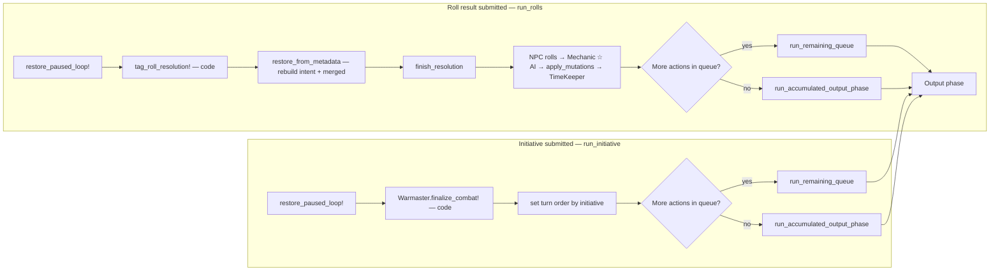

# Dungeon Master Pipeline — Flow Diagram & Comprehensive Reference

High-level flow of the AI DM pipeline. For per-step prompt/model detail see [Pipeline Steps](pipeline_steps.md).

---

## Main flow (run_prompt)

```mermaid
flowchart TB
    subgraph entry["Entry — DungeonMasterService"]
        A[Player Input] --> PRE0{Usage limit?}
        PRE0 -->|yes| ULIMIT[Return :usage_limit_exceeded]
        PRE0 -->|no| PRE1[Log abandoned pipeline?]
        PRE1 --> PRE2[Auto-finalize pending initiative?]
        PRE2 --> B[run_prompt]
    end

    subgraph gate["Gate — Intake  ☆ AI"]
        B --> C[run_intake]
        C --> E{danger_score ≥ threshold?}
        E -->|yes| REJECT[Return :rejected]
        E -->|no| F{is_dm_query? or mode='dm_query'?}
    end

    F -->|yes| G[DM Query branch]
    G --> G1[resolve_plot stub]
    G1 --> G2[run_dm_query  ☆ AI]
    G2 --> OUT_DM[Return :dm_query]

    F -->|no| SEQ

    subgraph seq_gate["Sequencer — conditional on action_queue toggle  ☆ AI"]
        SEQ[run_sequencer] --> SEQ1{Multiple actions?}
        SEQ1 -->|yes| SEQN["actions = [a1, a2, …aN]"]
        SEQ1 -->|no| SEQ2["actions = [input]"]
    end

    SEQN & SEQ2 --> ACTION_LOOP

    subgraph action_loop["Action loop — for each action"]
        ACTION_LOOP[Create AdventureLoop record] --> RESOLVE[CoreResolver.resolve]
    end

    subgraph resolve["CoreResolver.resolve — evaluation + sanity gate"]
        RESOLVE --> EVAL_MODE{evaluation_mode?}
        subgraph unified_eval["UnifiedEvaluation: 1 AI call for all 6 domains  ☆ AI ×1  (default)"]
            EVAL_MODE -->|unified| UNIFIED_EVAL[run_unified_evaluation]
        end
        subgraph parallel_eval["ParallelEvaluation: Node microservice — 3 HTTP phases"]
            EVAL_MODE -->|parallel| PE1["Phase 1: POST /fan_out — beacon ×6  ☆ AI ×6"]
            PE1 --> PE1B["converge_beacons — code"]
            PE1B --> PE2["Phase 2: POST /sequential — mech_eval ×N  ☆ AI ×N"]
            PE2 --> PE3["Phase 3: POST /fan_out — roll_qualifier ×N  ☆ AI ×N"]
        end

        UNIFIED_EVAL & PE3 --> NM{needs_mechanics?}
    end

    NM -->|yes| SANITY_GATE
    NM -->|no| WORLD_ONLY

    subgraph sanity_gate["Sanity gate — mechanical path"]
        SANITY_GATE --> SKIP_W{skip_world_sanity_check?}
        SKIP_W -->|yes| FG3[capability_check  ☆ AI]
        SKIP_W -->|no| FG2[world_consistency_check  ☆ AI]
        FG2 --> FG3
    end

    FG2 -->|not consistent| REJECT
    FG3 -->|not allowed| REJECT
    SANITY_GATE --> MERGE[merge_mechanical_evaluations — code]
    MERGE --> AUTOSUC[filter_auto_success_rolls!  — code]
    AUTOSUC --> ROLLCHECK{Player rolls still needed?}
    ROLLCHECK -->|yes| PAUSE_ROLLS[Return :awaiting_rolls]
    ROLLCHECK -->|no| FINISH_RES

    subgraph finish_res["finish_resolution — after rolls or auto-success"]
        FINISH_RES[resolve_npc_actions  — code] --> MECHANIC[run_mechanic  ☆ AI]
        MECHANIC --> APPLY_MUT[apply_mutations  — code]
        APPLY_MUT --> TK_MECH[run_time_keeper]
    end

    subgraph no_mech["Non-mechanical path"]
        WORLD_ONLY --> SKIP_W2{skip_world_sanity_check?}
        SKIP_W2 -->|no| WC[run_world_consistency_check  ☆ AI]
        WC -->|not consistent| REJECT
        SKIP_W2 -->|yes| EXPAND
        WC -->|consistent| EXPAND{expand_scene?}
        EXPAND -->|yes| SOCIAL[resolve_social_scene  ☆ AI]
        SOCIAL --> SOC_STATUS[status: :social_scene — breaks queue]
        EXPAND -->|no| TK_NM[run_time_keeper]
    end

    subgraph timekeeper["TimeKeeper — code-first estimation, then Harbinger"]
        TK_MECH & TK_NM --> TK1["estimate_time: journey? → code\ncombat? → code\nrest? → code\ntake_20? → code\nelse → AI ☆"]
        TK1 --> TK2[consult_harbinger_if_needed — code + optional AI ☆]
        TK2 --> TK3[GameClock.advance_clock!  — code]
        TK3 --> TK4[check_thresholds + apply_fatigue_conditions  — code]
        TK4 --> ENC_CHECK{encounter triggered?}
    end

    ENC_CHECK -->|yes| WARMASTER_A[Warmaster Path A — from Harbinger]
    ENC_CHECK -->|no| NENC

    subgraph warmaster_a["Warmaster Path A — encounter table creature spawn"]
        WARMASTER_A --> WA1[initialize_from_encounter!]
        WA1 --> WA2{Creatures spawned?}
        WA2 -->|yes| WA3[roll creature initiatives  — code]
        WA3 --> PAUSE_INIT[Return :awaiting_initiative]
        WA2 -->|no| ENC_STATUS[status: :encounter — breaks queue]
    end

    NENC --> NM_RESOLVED{Path?}
    NM_RESOLVED -->|mechanical| MECH_RESOLVED["status: :resolved\n(from finish_resolution)"]
    NM_RESOLVED -->|non-mechanical| MOMENTUM_STEP[run_momentum  ☆ AI]
    MOMENTUM_STEP --> NM_RESOLVED2["status: :resolved\n(from momentum)"]

    MECH_RESOLVED & NM_RESOLVED2 --> LOOP_OUTCOME

    subgraph loop_outcomes["Action loop outcome dispatch"]
        LOOP_OUTCOME{result.status?}
        LOOP_OUTCOME -->|:rejected| REJECT_EARLY[Return :rejected — pipeline ends]
        LOOP_OUTCOME -->|:awaiting_rolls| PAUSE_ROLLS_OUT[Return :awaiting_rolls — pipeline pauses]
        LOOP_OUTCOME -->|:awaiting_initiative| PAUSE_INIT_OUT[Return :awaiting_initiative — pipeline pauses]
        LOOP_OUTCOME -->|:encounter| BREAK_ENC[break action queue → output phase]
        LOOP_OUTCOME -->|:social_scene| BREAK_SOC[break action queue → output phase]
        LOOP_OUTCOME -->|:resolved| ACCUMULATE[accumulate result]
        LOOP_OUTCOME -->|":resolved + per_action_narration"| PROGRESSIVE_NARRATE["run_single_action_narrative_phase\n+ on_narrative callback"]
        PROGRESSIVE_NARRATE --> ACCUMULATE
    end

    ACCUMULATE --> INTER_CTX{More actions in queue?}
    INTER_CTX -->|yes| CTX_UPDATE[run_inter_action_context_update  ☆ AI]
    CTX_UPDATE --> ACTION_LOOP
    INTER_CTX -->|no| OUTPUT_PHASE

    BREAK_ENC & BREAK_SOC & MECH_RESOLVED & NM_RESOLVED2 --> OUTPUT_PHASE

    subgraph output_phase["Output phase — run_accumulated_output_phase"]
        OUTPUT_PHASE --> CHRON{story has plot data?}
        CHRON -->|yes| CHRONICLER[run_chronicler  ☆ AI]
        CHRONICLER --> CHRON_OUT[dm_brief + forbidden_elements + plot_state updates]
        CHRON -->|no| SKIP_CHRON[dm_brief = nil]
        CHRON_OUT & SKIP_CHRON --> STAGEHAND[run_output_phase — Stagehand]
        STAGEHAND --> COMBAT_CHECK{combat beacon signaled\ncombat_started?}
        COMBAT_CHECK -->|yes| WARMASTER_B[Warmaster Path B — from combat beacon]
        WARMASTER_B --> WB1[initialize_from_names!  ☆ AI for unknown creatures]
        WB1 --> WB2{Creatures spawned?}
        WB2 -->|yes| PAUSE_INIT_B[Return :awaiting_initiative]
        WB2 -->|no| NARRATE_PHASE
        COMBAT_CHECK -->|no| NARRATE_PHASE

        subgraph narrate_phase["Narration — mode controls threading"]
            NARRATE_PHASE --> NMODE{narration_mode?}
            NMODE -->|parallel default| PAR_NARRATE["run_narrate  ☆ AI\n+ run_context_updates — parallel threads"]
            NMODE -->|subjugated| SUB_NARRATE["run_context_updates first\nthen run_narrate  ☆ AI\n(sees fresh DB state)"]
        end

        subgraph ctx_update["Context updates — always run"]
            PAR_NARRATE & SUB_NARRATE --> MICRO[run_micro_context_update  ☆ AI]
            MICRO --> MACRO{macro_significant?}
            MACRO -->|yes| MACRO_UPDATE[run_macro_narrative_update  ☆ AI]
            MACRO -->|no| SKIP_MACRO[skip]
        end
    end

    MICRO & MACRO_UPDATE & SKIP_MACRO --> OUT_NARR[Return :narrated]
    PROGRESSIVE_NARRATE -.->|"all actions done"| OUT_SEQ["Return :narrated_sequence\n(progressive narration path)"]
```



---

## Resumption flows



---

## Comprehensive Pipeline Explanation

### Overview

The DM pipeline is a multi-step orchestration system that translates a player's free-form text input into a game outcome: narrative prose, dice roll requests, initiative prompts, or outright rejections. It runs exclusively as an **asynchronous Sidekiq job**: the HTTP request returns 202 immediately, the pipeline executes in the background, and results are delivered to the player via an ActionCable WebSocket. There is no synchronous path.

The rest of this document covers the budget pipeline.

---

### Live progress feedback

While a job runs, the player sees incremental status messages beneath the
animated thinking dots instead of a static spinner. Each AI-heavy step
calls `broadcast_progress("message")` at its entry point:

```ruby
def run_unified_evaluation(intention)
  broadcast_progress("Reading the situation...")
  # ...
end
```

`broadcast_progress` is a helper in `Steps::Helpers` that invokes an
`@on_progress` callback when present. `DungeonMasterService` wires that
callback to `AdventureChannel.broadcast_to`, which pushes a
`pipeline_progress` WebSocket event to the player's browser. The
`useAdventureMessages` hook patches the content of the thinking sentinel
in place so the status line animates in without replacing the dots.

| Step | Message shown to player |
|------|------------------------|
| `UnifiedEvaluation` | "Reading the situation..." |
| `ParallelEvaluation` | "Reading the situation..." |
| `Chronicler` | "Consulting the chronicle..." |
| `Narrate` | "Writing the story..." |
| `ContextUpdate` | "Remembering the world..." |

The callback is a no-op when `@on_progress` is not set (tests, console
runs), so adding a new progress call to a step requires no test changes.

---

### Pre-flight checks (before run_prompt)

Three checks run before the pipeline proper, all in `DungeonMasterService`:

1. **Usage limit** — Raises `UsageLimitExceeded` if the user has hit their quota. Returns a `usage_limit` system message.

2. **Abandoned pipeline log** — Detects if the previous pipeline was paused (a `roll_request` or `initiative_request` message exists) but the player submitted a new free-text message instead of the expected roll/initiative. Logs a `pipeline_abandoned` event for observability. Does **not** block the pipeline — the new message is processed normally.

3. **Auto-finalize pending initiative** — If an `initiative_request` message exists but the player's most recent response was a new free-text action (not an `initiative_result`), the pipeline auto-rolls the player's initiative using their DEX modifier and calls `Warmaster.finalize_combat!`. This silently resolves combat initialization so the new action can proceed with an active `combat_context`.

---

### Step 1 — Intake (AI)

The first AI call. Every message passes through this gate.

**What it does:**
- Scores the input for **prompt injection and meta-gaming** on a 0–10 danger scale.
- **Sanitizes** the input (strips OOC formatting, normalizes phrasing).
- Detects **DM queries** (player asking the DM a lore/rules question rather than acting).
- Flags potential **context domain gaps** (e.g., entering a new area type not in any existing context).

**Early exits:**
- If `danger_score >= config.danger_threshold` → pipeline halts, returns `{ action: :rejected }` immediately. No message is shown to the player except the reason from Intake.
- If `sanitized_input` is blank → raises `AiError`, caught by the service layer and turned into a "DM distracted" system message.

**Side effect:** Creates an `ExperienceSuggestion` record if Intake detected a possible new context domain to add to the story setup. This is observability-only and does not affect pipeline execution.

---

### Step 2 — DM Query branch (AI)

If Intake sets `is_dm_query = true`, or the controller passes `mode: "dm_query"`:

1. A stub `intent` is created with empty `affected_contexts`.
2. **Chronicler** is called via `resolve_plot` — but only if the story has NPC or clue data. This produces a `dm_brief` with plot-aware guidance.
3. **DM Query** (`run_dm_query`) produces the answer using the dm_brief as framing.
4. Returns `{ action: :dm_query, answer: ... }` — no context updates, no time advancement.

This is a **terminal branch** — nothing after it executes.

---

### Step 3 — Sequencer (AI, conditional)

Only runs if `DmConfig["action_queue"]` is enabled. Otherwise, returns the sanitized input as a single-element array.

**What it does:** Detects compound inputs ("I pick the lock, then open the door, then search the room") and splits them into an ordered array of discrete action strings. A single action returns `["input"]`. If the AI call fails, falls back to `[sanitized_input]`.

The resulting `actions` array drives the **action queue loop**.

---

### Step 4 — Action queue loop

The outer orchestration loop: for each action in the queue:

1. Creates an `AdventureLoop` record (tracks status, timeline events, raw outcome).
2. Calls **CoreResolver.resolve** — the inner pipeline (detailed below), passing the sanitized action text directly.
3. Dispatches on the result status (see "Outcomes" section).

**Inter-action context update:** When an action resolves (`:resolved` status) and there are more actions still in the queue, a `run_micro_context_update` call runs immediately before the next action. This updates the adventure's context JSONB fields so the next action's evaluation sees the freshest world state.

---

### Step 5 — CoreResolver.resolve

The inner pipeline entry point. Branches on `DmConfig["evaluation_mode"]`:

- **`"unified"` (default)** → `Steps::UnifiedEvaluation`
- **`"parallel"`** → `Steps::ParallelEvaluation` (Node microservice)

Both paths produce the same `[intent, evaluations]` output shape consumed by the rest of the resolver.

#### UnifiedEvaluation (`evaluation_mode: "unified"`)

A single AI call handles all 6 domains (`traversal`, `combat`, `social`, `exploration`, `rest`, `inventory`) in one pass, producing the intent hash and per-domain evaluations. The model determines which domains are affected, whether mechanics are needed, what rolls to request, and whether to expand a social scene — all without separate per-domain calls. Recommended model: gpt-5-mini or gpt-4.1-mini.

#### ParallelEvaluation (`evaluation_mode: "parallel"`)

Three sequential HTTP calls to the **Node evaluator microservice** (`evaluator/`), each implementing a different parallelism pattern. Requires `EVALUATOR_URL` to be set (default: `http://evaluator:3001`). The Node service is stateless — no DB access, no domain logic, no config; model and token budgets travel inline per request from `DmConfig`.

**Phase 1 — Beacons (`POST /fan_out`):** Renders 6 domain-specific beacon ERB prompts in Rails, then POSTs them to Node which runs all 6 OpenAI calls via `Promise.all`. `converge_beacons` (pure Ruby data merge) builds the intent hash from the 6 results.

**Phase 2 — Mechanical Evaluation (`POST /sequential`):** For each affected domain, Rails renders a base mech_eval system prompt (omitting previous summaries — Node injects them). Node runs calls sequentially, prepending accumulated `mechanical_summary` values to each subsequent prompt for cross-domain awareness.

**Phase 3 — Roll Qualifier (`POST /fan_out`):** For each domain result with rolls, Rails renders a roll_qualifier prompt. Node runs them in parallel. Rails applies the results (Take 10/20 eligibility, situational modifiers) and calls `compute_take_values` for sheet-math.

All Node results are persisted via `@log.ai_log!` — `PlayLog` and `AiUsageRecord` records are created identically to any other AI step. On Node 4xx/5xx, `partial_results` from the error body are logged before raising `AiError`.

The output `intent` hash (from either path) includes:
- `needs_mechanics` (bool) — any domain requires dice rolls.
- `expand_scene` (bool) — significant social interaction warrants a scene expansion.
- `affected_contexts` (array) — domain names that this action touches.
- `macro_significant` (bool) — major story beat (quest completion, boss defeat, critical secret).
- `destination`, `transition` — from the traversal domain.
- `domain_results` (hash) — per-domain detail (used by social expansion and Stagehand).

---

### Step 6 — Mechanical path (needs_mechanics = true)

The **sanity gate** validates the action before any mechanics are resolved. Its behaviour depends on the adventure's `skip_world_sanity_check` flag:

**Default (skip_world_sanity_check = false):** two checks run in parallel, then evaluation results from UnifiedEvaluation are merged:

| Thread | Step | Type |
|--------|------|------|
| world_thread | World consistency check | AI |
| cap_thread | Capability check | AI |

**When skip_world_sanity_check = true:** the world thread is skipped entirely. Only the capability check runs (no parallelism needed).

**World consistency check** — AI. Validates that entities, targets, and objects the player references actually exist in the current scene (checking scene_summary, scene_history, all micro contexts, NPC names). Returns `{ consistent: bool, reason: string, dm_message: string }`. Skipped when `skip_world_sanity_check` is set on the adventure.

**Capability check** — AI. Validates the player actually has the spell, feat, or item they're attempting to use. Returns `{ allowed: bool, reason: string }`. Always runs regardless of `skip_world_sanity_check`.

**Early exits from sanity gate:**
- World check fails → `:rejected` (optionally with a `dm_message` shown as narrative prose instead of a system error). Never reached when skipped.
- Capability check fails → `:rejected`.

**Post-gate processing (code):**

1. `merge_mechanical_evaluations` — flattens all domain results from UnifiedEvaluation.
2. `warn_duplicate_rolls` — detects duplicate roll requests across domains and logs a warning. Does **not** remove duplicates (any fix must come from prompt improvement).
3. `filter_auto_success_rolls!` — removes rolls the character cannot possibly fail: DC ≤ 0, skill modifier + 1 ≥ DC, or Take 10 value ≥ DC (and player is Take 10 eligible). Also keeps all attack rolls (never auto-succeed). Logs removed rolls for visibility.

**If any player rolls remain** → returns `{ status: :awaiting_rolls }`. Pipeline pauses.

**If no player rolls remain** (all were auto-successes, or NPC-only) → proceeds directly to `finish_resolution` with an auto-success message.

---

### Step 7 — Non-mechanical path (needs_mechanics = false)

**World consistency check** — Same AI call as above, but runs alone (no parallel threads). Skipped entirely when the adventure's `skip_world_sanity_check` flag is set; the pipeline proceeds directly to the expansion/TimeKeeper branch.

Early exit: world check fails → `:rejected`. Never reached when skipped.

**Social expansion branch** (`expand_scene = true`):
- Triggered when UnifiedEvaluation's social domain set `expand_scene`. Represents significant social interactions (negotiations, transactions, confrontations) that merit an immersive NPC scene.
- A single AI call (`social_expansion`) generates a rich scene description with NPC name, attitude, and new story elements.
- Returns `{ status: :social_scene }`. The action queue **breaks** — remaining actions are abandoned.
- TimeKeeper is **skipped**. No in-game time passes until the social scene resolves.

**TimeKeeper** (see dedicated section below) runs next. If an encounter is triggered → Warmaster Path A (see Combat section). Otherwise:

**Momentum** (AI) — Determines what factually happened when no dice were needed. Produces `outcome` (plain text), optionally `mutations`, and refines `affected_contexts` by merging the evaluation's assessment with its own. Also writes `verdict_outcome`, `pipeline_outcome`, and merged `affected_contexts` to the `AdventureLoop`.

Returns `{ status: :resolved }`.

---

### Step 8 — finish_resolution (post-roll path)

Runs after the player submits dice results, or immediately when auto-success is detected.

1. **resolve_npc_actions** — Pure code. Formats NPC dice results by rolling each NPC action's dice formula.
2. **run_mechanic** (AI) — Takes roll results + NPC results + mechanical summaries + consequences + character block + all micro contexts. Produces `outcome` (factual what-happened prose) and `mutations` (structured HP/condition/item changes).
3. **apply_mutations** (code) — Applies `mutations` to the character sheet and creature sheets immediately. Handles HP changes, condition additions/removals, item consumption, location transitions.
4. **run_time_keeper** — See dedicated section.

Returns `{ status: :resolved }` or `{ status: :awaiting_initiative }` or `{ status: :encounter }`.

---

### Time mechanics — TimeKeeper + Harbinger + GameClock

**TimeKeeper** runs on every resolved action (both mechanical and non-mechanical paths). It is a three-stage process:

#### Stage 1 — Time estimation (code-first priority)

Estimation uses this waterfall, short-circuiting at the first match:

| Condition | Method | Formula |
|-----------|--------|---------|
| Destination known (traversal beacon set `destination`) | Code | `distance_miles / speed_mph` (from character speed + terrain modifier) |
| Combat active (`combat_context.active = true`) | Code | 6 seconds = 0.0017 hours per round |
| Intention mentions rest/sleep/camp | Code | Short rest → 1h, Long rest → 8h |
| `@loop` tagged `took_20` | Code | 0.67 hours (~40 minutes) |
| Everything else | AI call | `time_keeper` prompt; clamps 0–720h |

Journey speed is computed from the character's base speed (ft/round), converted to mph, then multiplied by a terrain modifier from `DmConfig["terrain_speed_modifiers"]`.

#### Stage 2 — Harbinger consultation (code + optional AI)

Harbinger is **skipped** if:
- Combat is currently active.
- Estimated hours < 0.01 (negligible time).
- No encounter table exists for the story.
- `hours_since_last_encounter_check + estimated_hours < table.check_frequency_hours` (time threshold not yet reached).

When Harbinger runs, it simulates the passage in frequency-sized segments, rolling against the encounter table for each segment. If an encounter triggers:
- Fewer hours than requested are granted (encounter happened mid-way).
- `expand_encounter` is called: if the encounter table entry is "fixed" (has a description), it's used directly. Otherwise, an AI call generates the encounter scene, creature list, and new world elements.
- Encounter data (`encounter_entry_id`, `encounter_creatures`, `encounter_scene`) is stored in the `AdventureLoop` for Warmaster and Narrate to consume.

If 8+ hours pass on a journey without rest, Harbinger returns `:rest_needed` (fatigue interrupts travel).

#### Stage 3 — GameClock advance (code)

`GameClock.advance_clock!` updates `adventure.time_context`:
- `current_hour` — advances with overflow to next day(s).
- `adventure_day` — increments by days elapsed.
- `light_conditions` — derived from current hour: dawn (5–6), day (7–17), dusk (18–19), night (else).
- `hours_since_last_rest` — accumulated until a rest action resets it.
- `hours_since_last_encounter_check` — reset to 0 when Harbinger was consulted; otherwise accumulated.

If the action was a rest, `rest_clears_fatigue` is set in the time context.

`check_thresholds` and `apply_fatigue_conditions` then evaluate `hours_since_last_rest`:
- ≥ 16 hours → applies `fatigued` condition to the character sheet.
- ≥ 32 hours → applies `exhausted`.
- After a rest → removes both.

All character sheet condition changes call `recompute_derived_stats!`.

---

### Combat initialization — Two Warmaster paths

Combat can start in two fundamentally different ways:

#### Path A — Harbinger encounter table

Triggered when TimeKeeper's Harbinger rolls an encounter. The encounter table entry is retrieved from `@loop` (stored by Harbinger's `expand_encounter`). If the entry has a creature manifest (deterministic spawn list), creatures are spawned from it. If not but `encounter_creatures` was set by the AI expansion, those are used. Otherwise, spawning is aborted and the pipeline returns `{ status: :encounter }` (no initiative requested).

#### Path B — Combat beacon transition (Stagehand)

Triggered during the output phase when Stagehand detects that one or more beacons returned `transition: "combat_started"` (or ending in `_to_combat`). This handles narrative-originated combat: the player's description triggered a fight without an encounter table roll. Combatant names from all beacon results are passed to `Warmaster.initialize_from_names!`.

In both paths, `Warmaster`:
1. Finds or creates `CreatureSheet` records (bestiary lookup → fuzzy match → AI generation → template fallback).
2. Rolls each creature's initiative (d20 + DEX modifier, +4 for Improved Initiative feat).
3. Returns `{ status: :awaiting_initiative, creature_data: [...] }`.

The pipeline pauses, saves creature data + intent + mutations + remaining queue into the `initiative_request` message metadata. When the player submits their initiative roll, `run_initiative` is called, `Warmaster.finalize_combat!` sets `adventure.combat_context` with sorted turn order, and the queue resumes.

**If no creatures could be spawned** (all lookups failed), Path A returns `{ status: :encounter }` which breaks the action queue but doesn't pause for initiative. The encounter is narrated but no combat_context is created.

---

### Action queue outcomes

After `CoreResolver.resolve` returns, the action loop dispatches on `result[:status]`:

| Status | Behavior |
|--------|----------|
| `:rejected` | **Returns immediately** — pipeline ends. If `dm_message` is present, it's shown as DM prose; otherwise a system message. |
| `:awaiting_rolls` | **Returns immediately** — pipeline pauses. Serializes `intent`, `merged` (roll requests + NPC actions + consequences + summaries), and `remaining_actions` into the `roll_request` message metadata. |
| `:awaiting_initiative` | **Returns immediately** — pipeline pauses. Serializes `creature_data`, `intent`, `mutations`, and `remaining_actions` into the `initiative_request` metadata. |
| `:encounter` | **Breaks the action queue.** Remaining actions in the queue are discarded. Proceeds to output phase with encounter status. |
| `:social_scene` | **Breaks the action queue.** Remaining actions discarded. Proceeds to output phase. |
| `:resolved` | **Accumulates** result. Runs inter-action context update if more actions follow. Continues to next action. |

---

### Output phase — run_accumulated_output_phase

After all actions complete (or the queue breaks), the output phase runs.

Multiple resolved/encounter/social_scene results are **merged**: intentions concatenated with "; ", affected contexts unioned, `macro_significant` or-ed. The combined narration seed is assembled by querying all `AdventureLoop` rows for the current `pipeline_run_id` in `sequence_index` order and joining their `pipeline_outcome` fields with `"\n\nThen: "`.

#### Chronicler (AI, conditional)

Runs whenever the story has any plot data (`story_has_plot_data?` — NPCs, clues, or milestones).

Receives: story premise, all story NPCs + clues, player's progress (discovered/attempted clues, met NPCs, reached milestones), current location, verdict outcome, and context snippets.

Produces:
- `dm_brief` — narration guidance for the Narrate step (plot beats, NPC reactions to reveal, tone direction).
- `forbidden_elements` — elements the narrator must not introduce (unspoiled plot twists, unmet NPCs, unknown locations).
- `plot_state_updates` — new clues discovered/attempted, NPCs met, custom facts; persisted to `adventure.plot_state`.
- `adventure_complete` flag — if true, a system message announces the adventure's conclusion after narration.

#### Stagehand (Path B combat check)

Before narration, Stagehand checks if the most recent action's evaluation signaled a combat transition (`combat_started`, `*_to_combat`) via `intent[:beacon_results]`. If yes and no combat is already active, calls `Warmaster.initialize_from_names!` and potentially returns `:awaiting_initiative` before narration runs at all.

#### Narration modes

Controlled by `DmConfig["narration_mode"]`:

- **`parallel`** (default) — Narrate and context updates run in two simultaneous threads. Narrate produces prose using the current DB state; context updates write new context simultaneously.
- **`subjugated`** — Context updates run first (sequential), then Narrate runs with the freshly updated DB state. Useful when narrative consistency requires seeing the result of mutations before writing prose.

#### Narrate (AI)

The prose generator. Receives: story title/hook, story summary, all micro contexts, time context (current hour, adventure day, light conditions), `what_happened` (from `@loop.verdict_outcome`), the combined narration seed (assembled from `pipeline_outcome` across all loop rows for this pipeline run), dm_brief, forbidden_elements, journey data, encounter scene/creatures, pacing instructions, and directed play instructions.

Has a special fallback: if the model returns raw text instead of JSON, the text is treated as the narrative directly (`fallback_as: :dm_response`).

#### Context updates (AI, parallel threads)

**Micro context update** (always runs): Updates the affected + active context JSONB fields on the adventure. If traversal is in affected contexts, social is forced into the update scope (a location change may end the current social scene, so the AI must explicitly evaluate it rather than silently preserving it). Also updates `scene_summary` and `scene_history` (ring-buffered to `scene_history_depth` entries, default 10).

**Macro narrative update** (conditional on `macro_significant`): Updates `adventure.story_summary` — the rolling adventure log read by future Narrate and Chronicler calls.

---

### Resumption flows

**Roll resumption (`run_rolls`):**

1. `restore_paused_loop!` — finds the most recent paused `AdventureLoop` for this pipeline run.
2. `tag_roll_resolution!` — tags the loop with `took_20`, `took_10`, or `rolled`.
3. `restore_from_metadata` — reconstructs `intent` and `merged` from the `roll_request` message metadata.
4. `finish_resolution` — runs NPC actions → Mechanic → mutations → TimeKeeper.
5. If more actions were in the queue (`remaining_actions`), runs `run_remaining_queue` (same loop logic as `orchestrate_actions`). Otherwise, runs `run_accumulated_output_phase`.

**Initiative resumption (`run_initiative`):**

1. `restore_paused_loop!` — finds the paused loop.
2. `Warmaster.finalize_combat!` — writes `adventure.combat_context` with player + creature initiatives, sorted turn order.
3. Reconstructs intent, mutations, and remaining actions from metadata.
4. If more actions in queue → `run_remaining_queue`. Otherwise → `run_accumulated_output_phase`.

In both resumptions, the output phase reads `pipeline_outcome` from all `AdventureLoop` rows for the current `pipeline_run_id` — no in-memory seed accumulation is needed across the pause boundary.

---

### What is AI vs. what is code

| Component | AI? | Notes |
|-----------|-----|-------|
| Intake | ✅ AI | Danger scoring, sanitization, DM query detection |
| Sequencer | ✅ AI | Action splitting (skipped if `action_queue` off) |
| UnifiedEvaluation | ✅ AI | Single call: domain assessment + mechanics + roll qualification. Used when `evaluation_mode` = `"unified"` (default) |
| ParallelEvaluation (beacon) | ✅ AI ×6 | Per-domain intent classification via Node `/fan_out`. Used when `evaluation_mode` = `"parallel"` |
| ParallelEvaluation (mech_eval) | ✅ AI ×N | Sequential per-domain mechanical resolution via Node `/sequential`. Parallel mode only |
| ParallelEvaluation (roll_qualifier) | ✅ AI ×N | Per-domain Take 10/20 + situational modifiers via Node `/fan_out`. Parallel mode only |
| converge_beacons | ❌ Code | Merges 6 beacon results into the `intent` hash. Parallel mode only |
| World consistency check | ✅ AI | Scene/entity validation |
| Capability check | ✅ AI | Spell/feat/item ownership |
| Momentum | ✅ AI | Non-mechanical outcome |
| Social Expansion | ✅ AI | NPC scene generation |
| Mechanic | ✅ AI | Post-roll arbitration + mutations |
| TimeKeeper (journey, combat, rest, take_20) | ❌ Code | Deterministic formulas |
| TimeKeeper (freeform) | ✅ AI | Fallback when no code rule matches |
| Harbinger | ❌ Code + optional AI | Dice rolls against table; AI for scene expansion only |
| GameClock | ❌ Code | Pure arithmetic |
| Auto-success filter | ❌ Code | Math against character sheet |
| apply_mutations | ❌ Code | Structured writes to DB |
| resolve_npc_actions | ❌ Code | Dice rolling |
| Warmaster creature spawn (bestiary match) | ❌ Code | DB lookup |
| Warmaster creature spawn (unknown creature) | ✅ AI | When bestiary lookup fails |
| Warmaster initiative rolls | ❌ Code | d20 + DEX modifier |
| Warmaster finalize_combat! | ❌ Code | Sorts initiative order |
| Chronicler | ✅ AI | Plot state + dm_brief |
| Narrate | ✅ AI | Prose generation |
| Micro context update | ✅ AI | Updates context JSONBs |
| Macro narrative update | ✅ AI | Updates story summary |

---

### Early exits and pipeline pauses — summary

| Trigger | Type | What returns |
|---------|------|-------------|
| Usage limit exceeded | Hard stop | `:usage_limit_exceeded` system message |
| Intake danger score ≥ threshold | Hard stop | `:rejected` — reason from Intake |
| Intake: no sanitized_input | Hard stop → error | "DM distracted" system message |
| World consistency check fails | Hard stop | `:rejected` — optionally with dm_message |
| Capability check fails | Hard stop | `:rejected` |
| Player rolls needed | **Pause** | `:awaiting_rolls` — state in message metadata |
| Initiative needed (Path A or B) | **Pause** | `:awaiting_initiative` — state in metadata |
| Encounter triggered (no creatures) | Queue break | `:encounter` status → output phase |
| Social scene triggered | Queue break | `:social_scene` status → output phase |
| AiError / StandardError | Hard stop → error | "DM distracted" system message |
| TokenBudgetExceededError | Hard stop → error | "Could not reach AI service" message |
| No narrative from Narrate | Hard stop → error | AiError raised |
| No outcome from Mechanic | Hard stop → error | AiError raised |

---

### Step summary

| Step | Type | Purpose |
|------|------|---------|
| **Intake** | AI | Score danger, sanitize input, detect DM query, flag context gaps. |
| **Sequencer** | AI | Split compound player input into ordered discrete actions. Skipped if `action_queue` off. |
| **UnifiedEvaluation** | AI ×1 | Single call covering all 6 domains: affected?, needs_mechanics?, rolls, NPC actions, consequences, expand_scene, Take 10/20 eligibility. Active when `evaluation_mode` = `"unified"` (default). |
| **ParallelEvaluation** | Code orchestration + 3 HTTP phases to Node | Parallel re-implementation of the beacon→mech_eval→roll_qualifier chain. Active when `evaluation_mode` = `"parallel"`. Requires `EVALUATOR_URL`. |
| **↳ beacon** | AI ×6 (parallel, Node) | Per-domain intent classification. One call per domain, all 6 run concurrently via `Promise.all` in Node. |
| **↳ mechanical_evaluation** | AI ×N (sequential, Node) | Per-domain mechanical resolution for each affected domain. Sequential with cross-domain summary injection. |
| **↳ roll_qualifier** | AI ×N (parallel, Node) | Take 10/20 eligibility + situational modifiers per domain that has rolls. |
| **World consistency check** | AI | Validate referenced entities exist in current scene. Runs in the sanity gate (mechanics path) or standalone (non-mechanics path). Bypassed on both paths when the adventure's `skip_world_sanity_check` flag is set. |
| **Capability check** | AI | Validate player has required spells/feats/items. Runs in sanity gate (needs_mechanics only). Always runs regardless of `skip_world_sanity_check`. |
| **Auto-success filter** | Code | Remove rolls the character cannot possibly fail (DC ≤ 0, guaranteed modifier, Take 10 covers DC). Never removes attack rolls. |
| **Momentum** | AI | Non-mechanical outcome: what happened + affected contexts + optional mutations. |
| **Social Expansion** | AI | Immersive NPC scene for significant social interactions (`expand_scene` from evaluation). Skips TimeKeeper. |
| **Mechanic** | AI | Post-roll arbitration: factual outcome + structured mutations from rolls + NPC results. |
| **TimeKeeper** | Code + AI | Estimate time (code-first: journey/combat/rest/take_20, then AI) → consult Harbinger → advance GameClock → apply fatigue. |
| **Harbinger** | Code + AI | Segment-based encounter check against table. AI expands encounter scene if entry is non-fixed. |
| **GameClock** | Code | Advance current_hour, adventure_day, light_conditions, hours_since_last_rest, hours_since_last_encounter_check. |
| **Warmaster** | Code + AI | Initialize combat: spawn creatures (bestiary → AI → template), roll initiative. Two paths: encounter table (A) or narrative-triggered combat (B). |
| **Chronicler** | AI | Plot state management: discover clues, mark NPCs met, produce dm_brief + forbidden_elements for Narrate. Determines adventure_complete. |
| **Narrate** | AI | Prose generation from outcome + contexts + dm_brief + journey/encounter data + pacing directives. |
| **Micro context update** | AI | Update affected + active context JSONBs. Forces social re-evaluation on traversal changes. Updates scene_summary + scene_history. |
| **Macro narrative update** | AI | Update story_summary (rolling adventure log). Conditional on `macro_significant`. |

